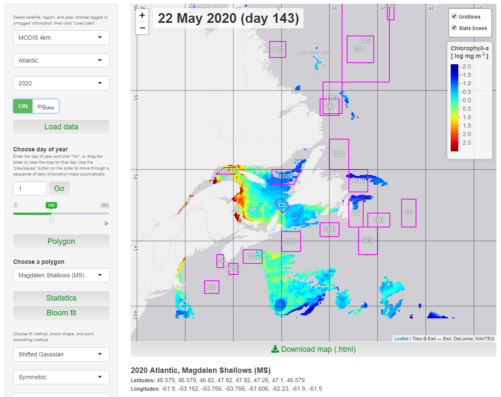

# PhytoFit

This app can be used to display satellite chlorophyll concentration, and calculate statistics and model phytoplankton blooms for regions within custom polygons. See below for example in screen capture.

<a target="_blank" href="screencap01.png">

</a>


## Prerequisites

1. Install the latest versions of R and RStudio.

2. Install the necessary libraries:
`fst, shiny, shinyWidgets, shinyjs, shinybusy, htmlwidgets, leaflet, leaflet.extras, quantreg, minpack.lm, rgdal, sp, ggplot2, grid, gridExtra, dplyr, geometry, raster, proj4`

3. Install a necessary fix for the leaflet.extras package:
``` r
# install.packages("remotes")
remotes::install_github("bhaskarvk/leaflet.extras", ref = remotes::github_pull("184"))
```

4. Restart R after the packages and fix have been installed.

5. Download this repository.

6. Download the data files (*.fst) from `ftp://ftp.dfo-mpo.gc.ca/bometrics/PhytoFit/` and store them in the appropriate subdirectories inside your local copy of the repository (`data/atlantic` and `data/pacific`).


## Running

Open app.R within RStudio, and click "Run app"


## Authors

* **Chantelle Layton** - *Initial concept, design, and coding*

* **Stephanie Clay** - *Significant modifications - extra features, formatting, new datasets*

## Acknowledgments

* **Andrea Hilborn** for many valuable suggestions

## Troubleshooting

* Density plot error: could not find function "expansion"

Solution: Update ggplot2
