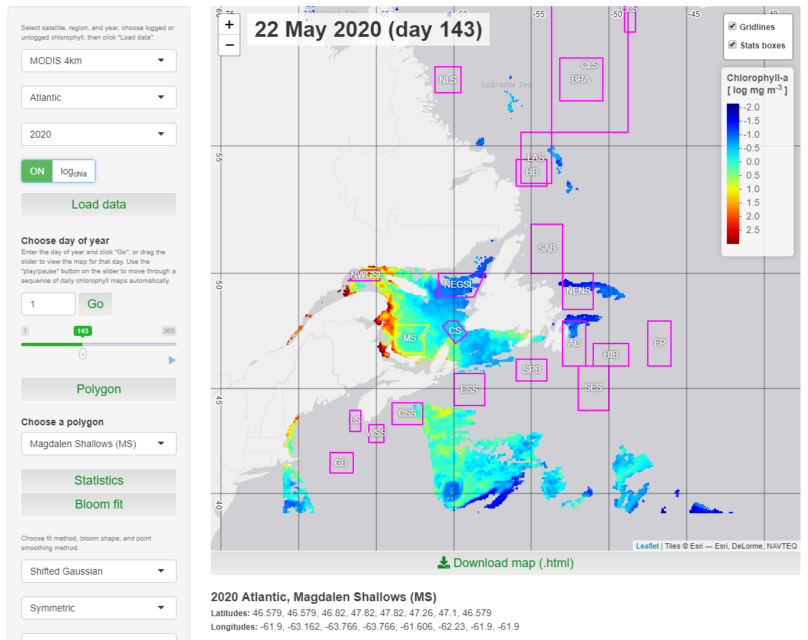

# PhytoFit

[](https://zenodo.org/badge/latestdoi/277295931)

This app can be used to display satellite chlorophyll concentration, and calculate statistics and model phytoplankton blooms for regions within custom polygons. See below for example in screen capture.

<a target="_blank" href="images/screencap01.png">

</a>

### How to cite

In publications, please include acknowledgements to <a href=\"https://oceancolor.gsfc.nasa.gov/\">NASA OBPG</a> for the raw satellite data and the <a href=\"https://github.com/BIO-RSG\">BIO remote sensing group</a> for the application, and use this citation in the references:  

*Stephanie Clay, Chantelle Layton, & Emmanuel Devred. (2021). BIO-RSG/PhytoFit: First release (v1.0.0). Zenodo. https://doi.org/10.5281/zenodo.4770754*  


## Prerequisites

1. Install the latest versions of R and RStudio.

2. Install the necessary libraries:
```r
install.packages(c("fst", "shiny", "shinyWidgets", "shinyjs", "shinybusy", "htmlwidgets", "leaflet", "leaflet.extras", "leafem", "quantreg", "minpack.lm", "rgdal", "sp", "ggplot2", "grid", "gridExtra", "dplyr", "geometry", "raster", "proj4", "curl"))
```

3. Install a necessary fix for the leaflet.extras package, and a custom package (oceancolouR):
```r
# install.packages("remotes")
remotes::install_github("bhaskarvk/leaflet.extras", ref = remotes::github_pull("184"))
remotes::install_github("BIO-RSG/oceancolouR")
```

4. Restart R after the packages and fix have been installed.

5. Download this repository one of two ways:  

- Code --> Download ZIP  
- Using git (this will make it easier to download updates in the future, by simply using the `git pull` command): Open git bash terminal, navigate to the folder where you want to download the repository, and type: `git clone https://github.com/BIO-RSG/PhytoFit.git`  

6. Download the datasets of your choice, in one of two ways:  

- Manually download from the ftp server where they're stored: `ftp://ftp.dfo-mpo.gc.ca/bometrics/PhytoFit_datasets/`  
- **Navigate to the PhytoFit repo on your local copy**, then run `download_new_datasets.R` and follow the prompts to download a dataset from the ftp server, or run `update_datasets.R` to update the datasets you have already downloaded with the most recent copies (and download any years of data missing from your local directory).  

**WARNINGS:**  
- Data files will be downloaded to `data/atlantic` or `data/pacific` subfolders of the PhytoFit repository - Do NOT move them from there or the app will not be able to read them.  
- If possible, please keep the data files if you intend to use them in the future, rather than re-downloading them later, to avoid excessive traffic on the ftp server.  


## Running

Open app.R within RStudio, and click "Run app"


## Authors

* **Chantelle Layton** - *Initial concept, preliminary design, coding, and algorithm development/improvements*  
* **Stephanie Clay** - *Final app design and modifications, feature addition, new datasets, maintenance, and algorithm improvements*  
* **Emmanuel Devred** - *Scientific support, algorithm development/improvements, review and feature recommendations*  

## Acknowledgments

* **Andrea Hilborn** for many valuable suggestions


## Links

[User guide](https://github.com/BIO-RSG/PhytoFit/blob/master/USERGUIDE.md) (In progress)  
[References and data sources](https://github.com/BIO-RSG/PhytoFit/blob/master/USERGUIDE.md#references-and-data-sources)  
[Using the raw (binned) data](https://github.com/BIO-RSG/PhytoFit/blob/master/fst_tutorial.md) (This is a quick tutorial explaining how the raw satellite chlorophyll data used in PhytoFit can be read into R and manipulated for other purposes)  
[Code updates affecting the algorithms](https://github.com/BIO-RSG/PhytoFit/blob/master/updates.md) (Summary of updates that affect the way the bloom metrics are calculated)  

