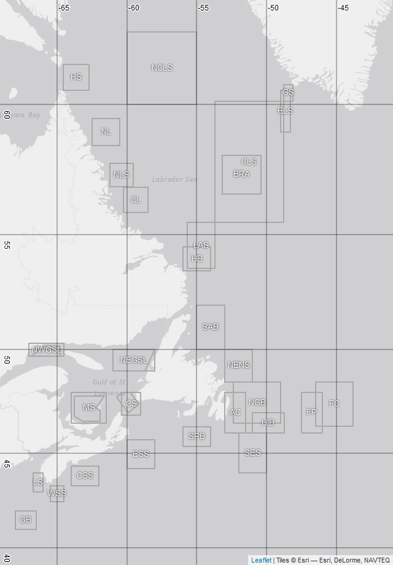
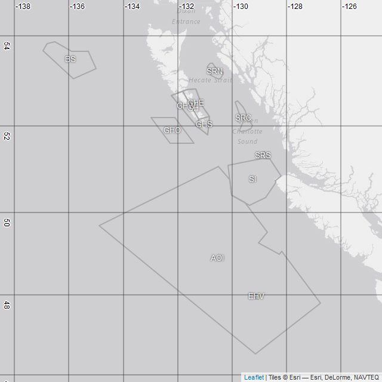
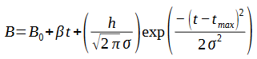

```{r setup, include=FALSE, echo=FALSE}
knitr::opts_chunk$set(echo = FALSE, comment=NA)
```

2020-09-25  
Report issues to: Stephanie.Clay@dfo-mpo.gc.ca  
  
***

# ACCESSING THE APP

## Option 1: DM APPS
*(DFO VPN access required)*  
*Address: http://dmapps:3838/PhytoFit/*

## Option 2: Github
*(Publicly available, updated more frequently)*  
*Address: https://github.com/BIO-RSG/PhytoFit*  

### PREREQUISITES
1. Install the latest versions of R and RStudio.
2. Install the necessary libraries:
`install.packages(c("fst", "shiny", "shinyWidgets", "shinyjs", "shinybusy", "htmlwidgets", "leaflet", "leaflet.extras", "leafem", "quantreg", "minpack.lm", "rgdal", "sp", "ggplot2", "grid", "gridExtra", "dplyr", "geometry", "raster", "proj4"))`
3. Install a fix for the leaflet.extras package, and a custom package (oceancolouR):
``` r
install.packages("remotes")
remotes::install_github("bhaskarvk/leaflet.extras", ref = remotes::github_pull("184"))
remotes::install_github("BIO-RSG/oceancolouR")
```
4. Restart R after the packages and fix have been installed.
5. Download this repository one of two ways:  

  - Code --> Download ZIP  
  - Using git (this will make it easier to download updates in the future): Open git bash terminal, navigate to the folder where you want to download the repository, and type: `git clone https://github.com/BIO-RSG/PhytoFit.git`  

**WARNING: individual data files are generally < 50mb, but the entire dataset is several GB. Check if you have enough space on your drive.** 


### INSTRUCTIONS
Open app.R within RStudio, and click "Run app".  


### WARNINGS FOR R USERS ONLY
* Memory usage increases as data is loaded/processed in the app. If the app is slowing down the computer, restart R (Session --> Restart R).  

* *Warning in if (sigma_limit1 < 0) { : the condition has length > 1 and only the first element will be used.*  [This warning might appear when running a Gaussian fit if two separate days have the same maximum chl-a concentration (the first instance of the maximum concentration will be used).]  


# WARNINGS  

* Large custom polygons (>500 degrees square) are not allowed due to memory issues.

* Small custom polygons (i.e. < a few pixels) will give unpredictable results because the map displays a projected raster of the original binned data, so the location of points is not 100% accurate, but very close. This could become noticeable if the user tries to select a very small number of datapoints on the map since the selection might contain a different number of binned values than rasterized pixels, or pixels with noticeably different values than the binned values due to projection issues.  

* Do not leave the app running for an extended period of time (hours) or through several large time series processing runs (for example, using all existing boxes for all available years). It's a good idea to restart every now and then to clear memory.  


# FUTURE OPTIONS


* Manually adjust fit parameters
* OLCI 4km
* Infer starting guesses for *nlsLM()* from the actual values (example: B<sub>0</sub> = median chlorophyll-a), or allow user to select them
* Exclude specific days from the fit
* Disjoint polygons
* Script contains code to create a popup when user clicks a single point on the map, displaying the latitude/longitude/chlorophyll value at that point. The code displays two chla values: "rasterized.chlorophyll.a", which is the value projected on the map, and "chlorophyll.a", which is the actual binned value nearest that point. [This popup feature is currently disabled because the popups interfere with drawing/editing polygons.]  
* Climatology datasets  


# REFERENCES AND DATA SOURCES


- __Bloom fitting models (*Shifted Gaussian*, *Rate of Change*, and *Threshold* methods)__:  
TECH REPORT IN PROGRESS  

- __Chlorophyll-a algorithm *OCx*__:  
[O'Reilly, John & Maritorena, S. & Mitchell, B.G. & Siegel, David & Carder, Kendall & Garver, S.A. & Kahru, Mati & Mcclain, Charles. (1998). Ocean color chlorophyll algorithms for SeaWiFS. Journal of Geophysical Research. 103. 937-953.](https://www.researchgate.net/publication/284463756_Ocean_color_chlorophyll_algorithms_for_SeaWiFS)  

- __Chlorophyll-a algorithm *GSM*__:  
[Maritorena, Stéphane & Siegel, David & Peterson, Alan. (2002). Optimization of a semianalytical ocean color model for global-scale application. Applied optics. 41. 2705-14. 10.1364/AO.41.002705.](https://www.researchgate.net/publication/11345370_Optimization_of_a_semianalytical_ocean_color_model_for_global-scale_application)  

- __Chlorophyll-a algorithms *OCx*, *POLY4*, and *GSM_GS* (regional tuning)__:  
[Clay, S.; Peña, A.; DeTracey, B.; Devred, E. Evaluation of Satellite-Based Algorithms to Retrieve Chlorophyll-a Concentration in the Canadian Atlantic and Pacific Oceans. Remote Sens. 2019, 11, 2609.](https://www.mdpi.com/2072-4292/11/22/2609)  

- __Chlorophyll-a algorithm *EOF*__:  
[Laliberté, J.; Larouche, P.; Devred, E.; Craig, S. Chlorophyll-a Concentration Retrieval in the Optically Complex Waters of the St. Lawrence Estuary and Gulf Using Principal Component Analysis. Remote Sens. 2018, 10, 265.](https://www.mdpi.com/2072-4292/10/2/265)

- __Phytoplankton cell size model 1 (small/large cells)__:  
[Devred, Emmanuel & Sathyendranath, S & Stuart, V & Maass, H & Ulloa, Osvaldo & Platt, T. (2006). A two-component model of phytoplankton absorption in the open ocean: Theory and applications. Journal of Geophysical Research. 111. 10.1029/2005JC002880.](https://www.researchgate.net/publication/229086123_A_two-component_model_of_phytoplankton_absorption_in_the_open_ocean_Theory_and_applications)  

- __Phytoplankton cell size model 2 (small/medium/large cells)__:  
[Devred, Emmanuel & Sathyendranath, Shubha & Stuart, Venetia & Platt, Trevor. (2011). A three component classification of phytoplankton absorption spectra: Application to ocean-color data. Remote Sensing of Environment - REMOTE SENS ENVIRON. 115. 2255-2266. 10.1016/j.rse.2011.04.025.](https://www.researchgate.net/publication/251494326_A_three_component_classification_of_phytoplankton_absorption_spectra_Application_to_ocean-color_data)  

- __Phytoplankton cell size models (updated coefficients)__:  
[Liu, Xiaohan & Devred, Emmanuel & Johnson, Catherine. (2018). Remote Sensing of Phytoplankton Size Class in Northwest Atlantic from 1998 to 2016: Bio-Optical Algorithms Comparison and Application. Remote Sensing. 10. 10.3390/rs10071028.](https://www.researchgate.net/publication/326033452_Remote_Sensing_of_Phytoplankton_Size_Class_in_Northwest_Atlantic_from_1998_to_2016_Bio-Optical_Algorithms_Comparison_and_Application#pf18)  

- __Raw data__:  
Daily level-3 binned files are downloaded from [NASA OBPG](https://oceancolor.gsfc.nasa.gov), and weekly composites are generated by taking a simple arithmetic average of each pixel over an 8-day period (46 weeks/year). The binned data is used for statistics and bloom fitting, and rasterized and projected onto the map using [EPSG:3857](https://spatialreference.org/ref/sr-org/7483/) (the Web Mercator projection) for faster image loading.  
[NASA OCx chlorophyll-a algorithm](https://oceancolor.gsfc.nasa.gov/atbd/chlor_a)  
[Level-3 binned files](https://oceancolor.gsfc.nasa.gov/products)  
[Binning scheme](https://oceancolor.gsfc.nasa.gov/docs/format/l3bins)  
[Level-3 binned default flags](https://oceancolor.gsfc.nasa.gov/atbd/ocl2flags)  
*Notes*:  
    - PhytoFit uses the 2018 OC (ocean colour) reprocessed data. More info on reprocessing versions [here](https://oceancolor.gsfc.nasa.gov/reprocessing).  
    - Flags used = L3 default mask, and FILTER  


***

# INSTRUCTIONS


## LEFT SIDEBAR

### Option 1: Load an existing settings file

If you saved a csv settings file from a previous session in PhytoFit, you can load it to automatically reapply the settings.  
Warning: **DO NOT EDIT THE CSV FILE**, otherwise PhytoFit might not be able to read it properly.

1. Click "Browse"
2. Select csv file and click "Open"
3. Click "Apply settings" and wait a moment while the settings are applied and the data is loaded.


### Option 2: Adjust settings manually

#### MAIN INPUT

Select:  

1.  Satellite/resolution  
    + MODIS-Aqua 4km-resolution  
    + VIIRS-SNPP 4km-resolution  
    + SeaWiFS 4km-resolution  
2.  Region  
    + Atlantic (42 to 71 degrees west, 39 to 63 degrees north)  
    + Pacific (122 to 140 degrees west, 46 to 60 degrees north)  
3. Algorithm  
    + OCx (global, band ratio)  
    + POLY4 (regional, band ratio)  
    + GSM_GS (regional, semi-analytical)  
4. Chl-a concentration type  
    + Full chlorophyll-a concentration  
    + Cell size model 1: Small/Large cell concentrations  
    + Cell size model 2: Small/Medium/Large cell concentrations  
      *__Note__: The cell size model is applied to the chlorophyll-a data immediately after loading, before it is logged (if the user selects logged chl-a) or averaged over 8 days (if user selects weekly data composites).  
5. Cell size (if not using full concentration)  
    + Small or large (from cell size model 1), OR  
    + Small, medium, or large (from cell size model 2)  
6. Year  
    + 2003-2021 (MODIS)  
    + 2012-2021 (VIIRS)  
    + 1997-2010 (SeaWiFS)  
7. Temporal binning  
    + Daily  
    + Weekly (mean value of 8-day intervals)  
      *__Note__: For weekly data, the daily data is averaged over the 8-day period before logging it (if selected).  
8. Logged or unlogged chlorophyll-a  

Click "Load data".  
*NOTE: Changes to any of the 8 options above will not be used until the "load" button is clicked.*


#### COLOUR SCALE
Adjust range of data used in the map colour scale.  


#### DAY OF YEAR
Enter a day of year from 1-365 and click "Go", or use the slider and play/pause button to advance through the days automatically.  


#### POLYGON

Click the grey/green "Polygon" button to expand the menu, then use the drop-down menu to choose an existing polygon which will be highlighted on the map, or choose "Custom polygon" to create your own.  

If you choose "Custom polygon":  

1. *(Optional)* Name your polygon and click "Apply"  
2. Choose how to define polygon vertices by selecting one of 3 options, then follow the instructions below:  

    + **Option 1:** Draw it on the map  
      
      Scroll up to the draw toolbar at the top left corner of the map.  
      Controls on the toolbar: zoom in/out, draw irregular polygon or a box, edit polygon, and delete polygon.  
      To draw an irregular polygon, click the first draw icon (the pentagon) and click the points on the map where you want the vertices to be. To finish the polygon, click the first point or click the "finish" button.  
      To draw a square, use the second draw icon.  
      As of 26 Sep 2020, only one polygon can be drawn on the map at a given time. If you draw a new polygon, the old one will be deleted automatically. 
    + **Option 2:** Type the coordinates of the vertices and click "Create polygon"  
    
      Latitide/longitude formatting:  
        + decimal degrees  
        + separated by commas  
        + use latitude/longitude < 0 for south/west  

    + **Option 3:** Load a shapefile (.shp)  
      
      Click "Browse" to find a shapefile.  
      Select the "shp" file and all files with the same name but different extensions (e.g. dbf, sbn, sbx, shx, prj, qix...).  
      Click "Open" and the polygon will be automatically loaded (this may take several seconds for larger polygons. If it does not load and display on the map automatically, click "Create polygon").  
      **WARNINGS:**  
      
        - The shapefile is read using the command below, and must contain a continuous *SpatialPolygonsDataFrame* (i.e. NO DISJOINT POLYGONS):  
          `rgdal::readOGR(dsn=filename)@polygons[[1]]@Polygons[[1]]@coords`  
        - If there are multiple polygons in the shapefile, only the first one will be used  


        
#####  EXISTING BOXES

These are the predefined boxes used in PhytoFit (full names and coordinates in the table below).  

Atlantic | Pacific
:-------------------------:|:-------------------------:
  |  

```{r echo=FALSE, message=FALSE, warning=FALSE}
source("00_regionBoxes.R")
library(kableExtra)
library(dplyr)
library(forcats)

reg_lons_atl <- sapply(1:length(all_regions[["atlantic"]]), function(i) paste0(all_regions[["atlantic"]][[i]]$lon, collapse=", "))
reg_lats_atl <- sapply(1:length(all_regions[["atlantic"]]), function(i) paste0(all_regions[["atlantic"]][[i]]$lat, collapse=", "))
reg_lons_pac <- sapply(1:length(all_regions[["pacific"]]), function(i) paste0(all_regions[["pacific"]][[i]]$lon, collapse=", "))
reg_lats_pac <- sapply(1:length(all_regions[["pacific"]]), function(i) paste0(all_regions[["pacific"]][[i]]$lat, collapse=", "))

df <- data.frame(Region = c(rep("ATLANTIC", length(reg_lons_atl)), rep("PACIFIC", length(reg_lons_pac))),
                 Abbreviation = c(poly_ID[["atlantic"]], poly_ID[["pacific"]]),
                 Name = c(full_names[["atlantic"]], full_names[["pacific"]]),
                 Longitudes = c(reg_lons_atl, reg_lons_pac),
                 Latitudes = c(reg_lats_atl, reg_lats_pac),
                 stringsAsFactors = FALSE)

# # this does not work with github_document
# df <- df %>%
#   dplyr::select(-Region)# %>%
#   # knitr::kable() %>%
#   # kable_styling(font_size = 10) %>%
#   # # column_spec (1:4, border_left = TRUE, border_right = TRUE) %>%
#   # pack_rows(tab_kable,
#   #           colnum = 1,
#   #           index = table(fct_inorder(factor(df$Region))),
#   #           label_row_css = "border-bottom: 0px; font-size: 14px;")
# df

# formatting for github_document
df1 <- df %>% dplyr::filter(Region=="ATLANTIC") %>% dplyr::select(-Region)
df2 <- df %>% dplyr::filter(Region=="PACIFIC") %>% dplyr::select(-Region)
df <- rbind(c("**ATLANTIC**","","",""), df1,
            c("**PACIFIC**","","",""), df2)
df
```


#### STATISTICS

Click the grey/green "Statistics" button to expand the menu.  

1.  Minimum daily percent coverage  
    If the polygon does not have the required percent coverage for the selected day/week, the density plot will not be created.       Days/weeks below this percentage will be excluded from the time series and not used in the bloom fitting.  

2.  Outlier detection method  
      + mean ± 2 standard deviations  
      + mean ± 3 standard deviations  
      + median ± 1.5 * interquartile range  
  
3.  Daily statistic (mean or median)  
    Statistic computed on the chlorophyll within the selected polygon for each day/week.  

4.  Range of pixel values  
    Pixels outside this range will not be used in the computation of the statistics or bloom fit.  


#### BLOOM FITTING

Click the grey/green "Bloom fit" button to expand the menu.  

Each point in the time series and bloom fit is the daily (or weekly) spatial average (or median) of data after removal of outliers and points outside the desired range, using the binned chlorophyll-a values. Only points with sufficient percent coverage inside the polygon on that day/week are used, within the range of days selected by the user.  

**Calculated metrics:**  

| Metric | Units | Description |
|--------|-------|-------------|
| t<sub>start</sub> | Day | day of the start of the bloom |
| t<sub>max</sub> | Day | day of maximum concentration |
| t<sub>end</sub> | Day | day of the end of the bloom |
| t<sub>duration</sub> | Day | duration of the bloom |
| Amplitude | mg m<sup>-3</sup> | maximum concentration of the bloom |
| Magnitude | (mg m<sup>-3</sup>) * days | area under bloom data points |

Each bloom fit model (Shifted Gaussian, Rate of Change, or Threshold) calculates amplitude and magnitude using the real values:  

- Amplitude<sub>real</sub>: Maximum real data value between t<sub>start</sub> and t<sub>end</sub>  
- Magnitude<sub>real</sub>: Area under the real data points from start to end of the bloom  

The Shifted Gaussian also calculates amplitude and magnitude using the fitted curve:  

- Amplitude<sub>fit</sub>: Height of the curve at t<sub>max</sub>  
- Magnitude<sub>fit</sub>: Area under the curve from start to end of the bloom  

*Notes:*  

- If "remove background" has been checked, the background chlorophyll-a line will be subtracted before calculating these values.  
- If points between t[start] and t[end] are below the background line and "remove background" has been selected, the magnitude (area) below the line will be negative so it will be subtracted from the final value (note this only affects Magnitude<sub>real</sub> when "remove background" has been checked)  


1.  Choose the fit method  
    + Shifted Gaussian (recommended)  
    + Rate of Change  
    + Threshold  
    See [TECH REPORT 2020 LINK] for details, or scroll down for a brief description.  


2.  Choose the shape of the curve  
    + Symmetric  
    + Asymmetric  


3.  Point smoothing  
    + No smoothing  
    + LOESS (locally estimated scatterplot smoothing)  
      + LOESS span (a parameter to control the degree of smoothing)  


4.  t<sub>range</sub> slider  *(Default: 31-274)*  
    Set the range of days to use in the fit.  
    *NOTE: The t<sub>start</sub> and t<sub>max</sub> sliders will automatically be adjusted to be within t<sub>range</sub>*.  


5.  t<sub>max</sub> slider  *(Default: 91-181)*  
    Set the range of days to search for the maximum concentration of the bloom.  
    *NOTE: This is restricted by t<sub>range</sub>, and t<sub>start</sub> will be automatically adjusted based on this value*.  


6.  t<sub>start</sub> slider  *(Default: 60-151)*  
    Set the range of days to search for the initiation of the bloom.  
    *NOTES:*  
    + *This is restricted by t<sub>range</sub> and t<sub>max</sub>*  
    + *If the t<sub>max</sub> switch (not the slider) is set to ON, this option is unavailable (see t<sub>max</sub> switch below for explanation)*  


7.  Extra options  

    + For Shifted Gaussian:  
    
        + t<sub>max</sub> switch (NOT the slider)  
        Allow t<sub>max</sub> to vary as a parameter within *nlsLM()*, rather than being a fixed value based on the actual maximum concentration.
        
          > *NOTE: t<sub>start</sub> can't be restricted if this is set to ON*.  
          > The reason for this: t<sub>start</sub> is restricted by adjusting σ, the parameter controlling the width of the curve, relative to a constant t<sub>max</sub>. If the t<sub>max</sub> button is set to ON, then both σ and t<sub>max</sub> are allowed to vary as parameters within *nlsLM()*, so they can't be used to restrict t<sub>start</sub> to a constant range of possible days.  
          > If the t<sub>max</sub> button is OFF and t<sub>start</sub> is limited, the limitations on t<sub>start</sub> are implemented by adjusting the limitations on σ, like so:  
          > σ<sub>upper</sub> = (t<sub>max</sub> - t<sub>start_lower</sub>) / 1.79  
          > σ<sub>lower</sub> = (t<sub>max</sub> - t<sub>start_upper</sub>) / 1.79  
        
        + β * t  
        Allow a linear rate of change on either side of the bloom curve (this can tilt the horizontal line of background chlorophyll-a).  
        
        + weights  
        Weight each point in the fit by the percent coverage inside the polygon on that day/week.  
        
        + Flags  
          Fits are flagged (unaffected but marked) if the following occurs:  
          Flag 1: (Fitted curve at t<sub>max</sub>) / (Real value at t<sub>max</sub>) is outside the range specified by the user (default: 0.75-1.25)  
          Flag 2: (Magnitude under curve) / (Magnitude under real values) is outside the range specified by the user (default: 0.85-1.15)  
          Flag 3: Sigma (parameter controlling the width of the curve) is <= time resolution (i.e 1 for daily data, or 8 for weekly data)  
        
        + Remove background  
          If this is checked, the background chlorophyll-a line will be subtracted from the data points / curve before calculating the amplitude and magnitude.  
        
        
    + For Threshold:  
    
        + threshold coefficient  
        
          > t<sub>start</sub> is defined as the point where chlorophyll-a drops below the threshold for > 14 days, measuring the days/weeks backward from the day of maximum concentration  
          > threshold = (threshold coefficient) * (median chlorophyll-a)  
          > median chlorophyll-a = median of the chlorophyll-a within the selected day range and >= the selected percent coverage (i.e. all the data points used in a bloom fit) 


##### SHIFTED GAUSSIAN  



| Parameter | Units | Description |
| --------- | ----- | ----------- |
| B | mg m<sup>-3</sup> | vector of mean (or median) measured chla concentration for each day (or week) |
| t | day of year | vector of days, same length as B |
| B<sub>0</sub> | mg m<sup>-3</sup> | background chlorophyll-a concentration |  
| β (beta) |	mg m<sup>-3</sup> day<sup>-1</sup> | linear rate of change of B<sub>0</sub> |  
| h | unitless | controls the height of the curve |  
| σ (sigma)	| unitless | controls the width of the curve |  
| t<sub>max</sub>	| day of year | day of maximum B |  


Unknown parameters calculated by nonlinear least squares:  
B<sub>0</sub>, h, σ (optional: β, t<sub>max</sub>)  

R function used for the nonlinear least squares fit to calculate the parameters: *nlsLM* (from the *minpack.lm* package)  

Lower/upper limits and starting guesses for *nlsLM*:  
  
|                |   | B<sub>0</sub> | h   | σ   | β      | t<sub>max</sub>           |
|----------------|---|---------------|-----|-----|--------|---------------------------|
| Lower limit    |   | 0             | 0   | 0   | -0.02  | User-selected             |
| Upper limit    |   | 5             | 350 | 100 | 0.01   | User-selected             |
| Starting guess | 1 | 0.5           | 50  | 10  | -0.002 | day of chla<sub>max</sub> |
|                | 2 | 0.5           | 50  | 2   | -0.002 | day of chla<sub>max</sub> |
|                | 3 | 0.5           | 10  | 2   | -0.001 | day of chla<sub>max</sub> |
|                | 4 | 0.5           | 10  | 1   | -0.001 | day of chla<sub>max</sub> |

*NOTES:*  

* _If curve is asymmetric, the same limits and guesses are used for each side_  
* _4 different sets of starting guesses are attempted before a dataset is declared unable to fit_  
* _If you're fitting weekly data, the week numbers are converted to the day of year at the start of each week, so the units are still day of year_  
* _B<sub>0</sub> limits if using logged chlorophyll-a: log(10<sup>-10</sup>) to log(5); starting guess: log(0.5)_  


##### RATE OF CHANGE  

This algorithm does not calculate a daily fitted equation, only the maximum, start, and end days of the bloom.  
The maximum is selected as the day of actual maximum concentration, within the selected range.  
The initiation is the day of the maximum rate of change in concentration, within the selected bounds.  
If any indices cannot be computed, they will be blank and not appear on the time series plot.  

B<sub>0</sub> is computed using the R function *rq()* from the *quantreg* package to perform a quantile regression (25th percentile) on the full dataset (days/weeks with sufficient percent coverage), and used to calculate the amplitude of the curve and the magnitude under the curve.  

  

##### THRESHOLD  

This algorithm does not calculate a daily fitted equation, only the maximum, start, and end days of the bloom.  
The maximum is selected as the day of actual maximum concentration, within the selected range.  
The initiation is the day that chlorophyll-a drops below a threshold for > 14 consecutive days, working backward from the day of maximum concentration.  

If you are using non-logged chl-a:  

Threshold = (Threshold coefficient) * (median chlorophyll-a used in the fit)  

If you are using logged chl-a:  

Threshold = log10((Threshold coefficient) * 10^(median log10(chlorophyll-a) used in the fit))  

Threshold coefficient = user-selected  

B<sub>0</sub> is computed using the same method as with the Rate of Change model.  

  

#### SAVE OPTIONS  

1. Settings (.csv)  
    
  The suggested file naming convention is *satellite_ region_ polygon_ compositeLength_ year_ day(s)_ cellSizes_ chlaAlgorithm_ fitmethod_ timecreated*, where:  
  - *satellite* is the first letter of the satellite and the spatial resolution,  
  - *region* is atlantic or pacific,  
  - *polygon* is the polygon abbreviation (or "custom"),  
  - *compositeLength* is daily or weekly,  
  - *year* is the current selected year,  
  - *day(s)* is the current selected day of year (or range of days of the week, if using weekly data),  
  - *cellSizes* is the current selected cell size (or cellSizeAll, if viewing full [chla]),  
  - *chlaAlgorithm* is the chlorophyll algorithm with "log" prefix if [chla] is logged, and  
  - *fitmethod* is the abbreviated version of the bloom fit model (gauss, roc, or thresh)  
  
  Note: This file is formatted in a way that it can be loaded back into PhytoFit later to reapply the same settings.  
  **WARNING**: Do NOT change the contents of the file, otherwise PhytoFit might not be able to read it correctly if you try to reapply it.  
    
2. Map (.html)  
3. Density plot (.png)  
4. Time series plot (.png)  
5. Annual table of daily (or weekly) statistics (.csv)  
6. Table of fitted bloom parameters (.csv)  
7. Download results from a series of years and polygons (.zip):  

* Select years using year slider  
* Select polygons to process from the dropdown menu (make sure you have at least one polygon selected, also if you have selected "Custom polygon", make sure the polygon is defined.)  
* Click "Run time series" to create:  
    + (Optional) PNG files for the bloom fit for each of the selected years  
    + (Optional) CSV files for each year containing the statistics for each day  
    + CSV file containing the fit parameters for those years  
    + CSV file containing the settings for the current run  
      Files will be zipped to a folder with the following name convention:  
      **satellite_ region_ compositeLength_ years_ cellSizes_ chlaAlgorithm_ fitmethod_ timecreated.zip**  
      (see "1. Settings (.csv)" for more details)  
* Click "Download results (.zip)"  
  This will download the zipped file to your browser's downloads folder.  


## MAIN VIEW PANEL  


### MAP  

**TOP LEFT**:  

- Zoom controls  
- Draw sidebar (if "custom polygon" is selected and data exists and is loaded for that day)  
    - Shapes:  
      	a. Irregular polygon (finish the polygon by clicking on the starting point)  
      	b. Rectangle  
    - Edit (click "save" when done, or cancel)  
    - Delete (click "save" when done, or cancel)  

**TOP RIGHT**:  

- Gridlines checkbox - uncheck to remove gridlines  
- Stats boxes checkbox - uncheck to remove existing (pre-defined) statistics boxes  
- Color bar, after data is loaded  

**BOTTOM**:  

Download button (map downloads in html format, which allows zooming/panning)   


### DENSITY PLOT  


### TIME SERIES PLOT  

Click on a data point and scroll up to see the data for that day (or week).  


# AZMP FITTING PARAMETERS  

AZMP boxes are typically fitted using a Fortran script, examining and adjusting every fit manually.  
Results found here: ftp://ftp.dfo-mpo.gc.ca/bometrics/spring-bloom  


Data used in the fit:  

- Sensor: VIIRS-SNPP  
- Resolution: ~1 km  
- L2 flags used: All flags except TURBIDW (turbid water)  
- Mapped to (39-82N, 42-95W) using cylindrical projection  
- Chlorophyll algorithm: Standard ocean colour algorithm (OCx) from NASA, NOT logged  
- Temporal binning: Weekly (daily can be too spiky, semi-monthly might miss the bloom)  

Statistics used in the fit:  

- Minimum weekly percent coverage inside a box: 1%  
- Outliers NOT removed  
- Weekly statistic used in a box: Mean  
- Range of pixel values used: <= 64 mg/m^3

Bloom fitting:  

- Model: Symmetric Shifted Gaussian  
- Range of days used in fit: Feb-July, and Feb-Aug for more northern boxes (>= 56N)
- No limit on day of max concentration or start of bloom, and points NOT weighted by percent coverage inside the box.  

Fits flagged if the following occurs:  

- Box has < 10% coverage (if so, the individual images that produced the stats are examined, and some might be removed and the bloom refitted, or they might be left in with a note of caution because removing them could remove the bloom from the image)  
- Ratio of peak chla concentrations (i.e. (chla<sub>max_curve</sub>) / (chla<sub>max_real</sub>) ) is not between 0.75 and 1.25  
- Ratio of magnitudes (area under the curve), Magnitude<sub>real</sub> / Magnitude<sub>curve</sub> is >= 0.15  
- Sigma (parameter controlling the width of the curve) is <= time resolution (i.e 1 day, or a week)  


## Differences between AZMP Fortran/manual fitting and PhytoFit  

Some differences are unavoidable due to the following:  

- PhytoFit uses the 8-day-per-week system (same as NASA) for weekly files, but AZMP fits use a 4-week-per-month system, so the weeks are not all the same length.  
- PhytoFit uses binned data (similar to a sinusoidal projection), but AZMP fits use files that have a cylindrical projection.  
- PhytoFit uses the default L3b NASA flags + FILTER ([here](https://oceancolor.gsfc.nasa.gov/atbd/ocl2flags)), but AZMP fits use files with all L2 NASA flags except TURBIDW.  
- PhytoFit is automated, but each AZMP fit is inspected manually and adjusted as necessary.  

*NOTE: The "fit flags" have slightly different definitions for PhytoFit and AZMP fits, but they do not affect the statistics/fit, only warn the user that the fit might have issues.*  


**PhytoFit settings to get most similar results to AZMP fits:**  

*Note: any settings that are not listed here have no constraints*  

- Satellite: VIIRS-SNPP 4km  
- Algorithm: OCx (global, band ratio)  
- Interval: Weekly  
- Chlorophyll-a logged: FALSE  
- Minimum weekly percent coverage: 1  
- Outlier detection method: None  
- Weekly statistic: Average  
- Minimum value used in the statistics and fit: 0 (leave the box blank in the app)  
- Maximum value used in statistics and fit: 64  
- Fit method: Shifted Gaussian  
- Bloom fit shape: Symmetric  
- Smoothing method: No smoothing  
- Allowed range of days for bloom fitting:  
    - For boxes < 56 degrees North: 31-212 (Feb-Jul)  
    - For boxes >= 56 degrees North: 31-244 (Feb-Aug)  
- Use t[max] parameter: FALSE  
- Use beta parameter: FALSE  
- Weight fit points by weekly percent coverage: FALSE
