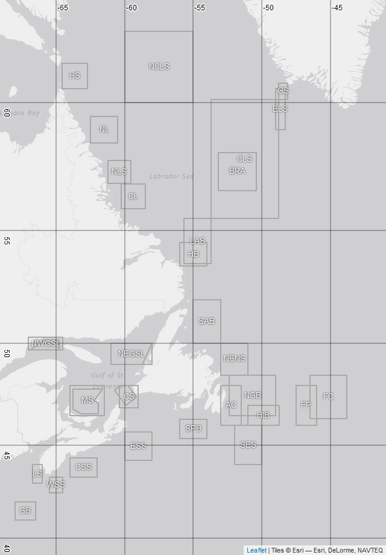
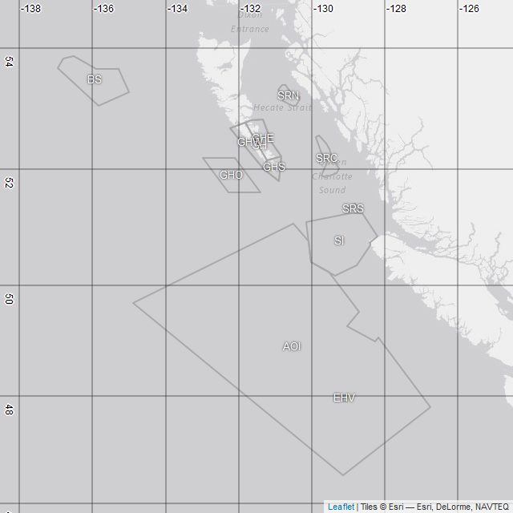
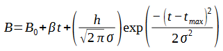

PhytoFit User Guide
================

  - [ACCESSING THE APP](#accessing-the-app)
      - [Option 1: DM APPS](#option-1-dm-apps)
      - [Option 2: Github](#option-2-github)
  - [WARNINGS](#warnings)
  - [FUTURE OPTIONS](#future-options)
  - [REFERENCES AND DATA SOURCES](#references-and-data-sources)
      - [INSTRUCTIONS](#instructions-1)
      - [AZMP FITTING PARAMETERS](#azmp-fitting-parameters)

2020-09-25  
Report issues to: <Stephanie.Clay@dfo-mpo.gc.ca>

-----

# ACCESSING THE APP

## Option 1: DM APPS

*(DFO VPN access required)*  
*Address: <http://dmapps:3838/PhytoFit/>*

## Option 2: Github

*(Publicly available, updated more frequently)*  
*Address: <https://github.com/BIO-RSG/PhytoFit>*

### PREREQUISITES:

1.  Install the latest versions of R and RStudio.
2.  Install the necessary libraries: `install.packages(c("fst", "shiny",
    "shinyWidgets", "shinyjs", "shinybusy", "htmlwidgets", "leaflet",
    "leaflet.extras", "leafem", "quantreg", "minpack.lm", "rgdal", "sp",
    "ggplot2", "grid", "gridExtra", "dplyr", "geometry", "raster",
    "proj4"))`
3.  Install a fix for the leaflet.extras package, and a custom package
    (oceancolouR):

<!-- end list -->

``` r
install.packages("remotes")
remotes::install_github("bhaskarvk/leaflet.extras", ref = remotes::github_pull("184"))
remotes::install_github("BIO-RSG/oceancolouR")
```

4.  Restart R after the packages and fix have been installed.
5.  Download this repository one of two ways:

<!-- end list -->

  - Code –\> Download ZIP  
  - Using git (this will make it easier to download updates in the
    future): Open git bash terminal, navigate to the folder where you
    want to download the repository, and type: `git clone
    https://github.com/BIO-RSG/PhytoFit.git`

**WARNING: individual data files are generally \< 50mb, but the entire
dataset is several GB. Check if you have enough space on your drive.**

### INSTRUCTIONS:

Open app.R within RStudio, and click “Run app”.

### WARNINGS FOR R USERS ONLY:

  - Memory usage increases as data is loaded/processed in the app. If
    the app is slowing down the computer, restart R (Session –\> Restart
    R).

  - *Warning in if (sigma\_limit1 \< 0) { : the condition has length \>
    1 and only the first element will be used.* \[This warning might
    appear when running a Gaussian fit if two separate days have the
    same maximum chl-a concentration (the first instance of the maximum
    concentration will be used).\]

# WARNINGS

  - Large custom polygons (\>500 degrees square) are not allowed due to
    memory issues.

  - Small custom polygons (i.e. \< a few pixels) will give unpredictable
    results because the map displays a projected raster of the original
    binned data, so the location of points is not 100% accurate, but
    very close. This could become noticeable if the user tries to select
    a very small number of datapoints on the map since the selection
    might contain a different number of binned values than rasterized
    pixels, or pixels with noticeably different values than the binned
    values due to projection issues.

  - Do not leave the app running for an extended period of time (hours)
    or through several large time series processing runs (for example,
    using all existing boxes for all available years). It’s a good idea
    to restart every now and then to clear memory.

# FUTURE OPTIONS

  - Manually adjust fit parameters
  - OLCI 4km
  - Infer starting guesses for *nlsLM()* from the actual values
    (example: B<sub>0</sub> = median chlorophyll-a), or allow user to
    select them
  - Exclude specific days from the fit
  - Disjoint polygons
  - Script contains code to create a popup when user clicks a single
    point on the map, displaying the latitude/longitude/chlorophyll
    value at that point. The code displays two chla values:
    “rasterized.chlorophyll.a”, which is the value projected on the
    map, and “chlorophyll.a”, which is the actual binned value nearest
    that point. \[This popup feature is currently disabled because the
    popups interfere with drawing/editing polygons.\]

# REFERENCES AND DATA SOURCES

Bloom fitting models (*Shifted Gaussian*, *Rate of Change*, and
*Threshold* methods):  
TECH REPORT IN PROGRESS

Chlorophyll-a algorithms *OCx*, *POLY4*, and *GSM\_GS*:  
[Clay, S.; Peña, A.; DeTracey, B.; Devred, E. Evaluation of
Satellite-Based Algorithms to Retrieve Chlorophyll-a Concentration in
the Canadian Atlantic and Pacific Oceans. Remote
Sens. 2019, 11, 2609.](https://www.mdpi.com/2072-4292/11/22/2609)

Chlorophyll-a algorithm EOF:  
[Laliberté, J.; Larouche, P.; Devred, E.; Craig, S. Chlorophyll-a
Concentration Retrieval in the Optically Complex Waters of the
St. Lawrence Estuary and Gulf Using Principal Component Analysis.
Remote Sens. 2018, 10, 265.](https://www.mdpi.com/2072-4292/10/2/265)

**Raw data**:  
Daily level-3 binned files are downloaded from [NASA
OBPG](https://oceancolor.gsfc.nasa.gov), and weekly composites are
generated by taking the average of each pixel over an 8-day period (46
weeks/year). The binned data is used for statistics and bloom fitting,
and rasterized and projected onto the map using
[EPSG:3857](https://spatialreference.org/ref/sr-org/7483/) (the Web
Mercator projection) for faster image loading.  
[NASA OCx chlorophyll-a
algorithm](https://oceancolor.gsfc.nasa.gov/atbd/chlor_a)  
[Level-3 binned files](https://oceancolor.gsfc.nasa.gov/products)  
[Binning scheme](https://oceancolor.gsfc.nasa.gov/docs/format/l3bins)  
[Level-3 binned default
flags](https://oceancolor.gsfc.nasa.gov/atbd/ocl2flags)  
*Note: PhytoFit uses the 2018 OC (ocean colour) reprocessed data. More
info on reprocessing versions here.* *NOTE: Flags used = L3 default
mask, and FILTER*

-----

## INSTRUCTIONS

<br>

### LEFT SIDEBAR

Select:

1.  Satellite/resolution
      - MODIS-Aqua 4km-resolution  
      - VIIRS-SNPP 4km-resolution  
      - SeaWiFS 4km-resolution  
2.  Region
      - Atlantic (42 to 71 degrees west, 39 to 63 degrees north)  
      - Pacific (122 to 140 degrees west, 46 to 60 degrees north)  
3.  Algorithm
      - OCx (global, band ratio)  
      - POLY4 (regional, band ratio)  
      - GSM\_GS (regional, semi-analytical)  
4.  Year
      - 2003-2020 (MODIS)  
      - 2012-2020 (VIIRS)  
      - 1998-2010 (SeaWiFS)  
5.  Temporal binning
      - Daily  
      - Weekly (mean value of 8-day intervals)  
6.  Logged or unlogged chlorophyll-a

Click “Load data”.  
*NOTE: Changes to any of the 6 options above will not be used until the
“load” button is clicked.*

<br>

#### COLOUR SCALE

Adjust range of data used in the map colour scale.

<br>

#### DAY OF YEAR

Enter a day of year from 1-365 and click “Go”, or use the slider and
play/pause button to advance through the days automatically.

<br>

#### POLYGON

Click the grey/green “Polygon” button to expand the menu, then use the
drop-down menu to choose an existing polygon which will be highlighted
on the map, or choose “Custom polygon” to create your own.

If you choose “Custom polygon”:

1.  *(Optional)* Name your polygon and click “Apply”  
2.  Choose how to define polygon vertices:  
    <br>
      - **Option 1:** Draw it on the map
        
        Scroll up to the draw toolbar at the top left corner of the
        map.  
        Controls on the toolbar: zoom in/out, draw irregular polygon or
        a box, edit polygon, and delete polygon.  
        To draw an irregular polygon, click the first draw icon (the
        pentagon) and click the points on the map where you want the
        vertices to be. To finish the polygon, click the first point or
        click the “finish” button.  
        To draw a square, use the second draw icon.  
        As of 26 Sep 2020, only one polygon can be drawn on the map at a
        given time. If you draw a new polygon, the old one will be
        deleted automatically.
    
      - **Option 2:** Type the coordinates of the vertices and click
        “Create polygon”
        
        Latitide/longitude formatting:
        
          - decimal degrees  
          - separated by commas  
          - use latitude/longitude \< 0 for south/west

<br>

##### EXISTING BOXES

These are the predefined boxes used in PhytoFit (full names and
coordinates in the table below).

| Atlantic                                                          | Pacific                                                          |
| ----------------------------------------------------------------- | ---------------------------------------------------------------- |
|  |  |

<div class="kable-table">

<table>

<thead>

<tr>

<th style="text-align:left;">

Abbreviation

</th>

<th style="text-align:left;">

Name

</th>

<th style="text-align:left;">

Longitudes

</th>

<th style="text-align:left;">

Latitudes

</th>

</tr>

</thead>

<tbody>

<tr>

<td style="text-align:left;">

**ATLANTIC**

</td>

<td style="text-align:left;">

</td>

<td style="text-align:left;">

</td>

<td style="text-align:left;">

</td>

</tr>

<tr>

<td style="text-align:left;">

AC

</td>

<td style="text-align:left;">

Avalon Channel (AC)

</td>

<td style="text-align:left;">

\-53, -53, -51.5, -51.5, -53

</td>

<td style="text-align:left;">

46, 48, 48, 46, 46

</td>

</tr>

<tr>

<td style="text-align:left;">

BRA

</td>

<td style="text-align:left;">

Bravo Station (BRA)

</td>

<td style="text-align:left;">

\-53.168, -53.168, -50.415, -50.415, -53.168

</td>

<td style="text-align:left;">

56.627, 58.127, 58.127, 56.627, 56.627

</td>

</tr>

<tr>

<td style="text-align:left;">

CS\_V01

</td>

<td style="text-align:left;">

Cabot Strait (CS) V01

</td>

<td style="text-align:left;">

\-60.4, -60.4, -59, -59, -60.4

</td>

<td style="text-align:left;">

46.9, 48, 48, 46.9, 46.9

</td>

</tr>

<tr>

<td style="text-align:left;">

CS\_V02

</td>

<td style="text-align:left;">

Cabot Strait (CS) V02

</td>

<td style="text-align:left;">

\-59.903, -60.73, -60.322, -59.783, -59.168, -59.903

</td>

<td style="text-align:left;">

47, 47.758, 48, 48, 47.436, 47

</td>

</tr>

<tr>

<td style="text-align:left;">

CL

</td>

<td style="text-align:left;">

Central Labrador (CL)

</td>

<td style="text-align:left;">

\-60.25, -58.5, -58.5, -60.25, -60.25

</td>

<td style="text-align:left;">

55.9, 55.9, 56.9, 56.9, 55.9

</td>

</tr>

<tr>

<td style="text-align:left;">

CLS

</td>

<td style="text-align:left;">

Central Labrador Sea (CLS)

</td>

<td style="text-align:left;">

\-53.7, -53.7, -48.8, -48.8, -53.7

</td>

<td style="text-align:left;">

55.5, 60.1, 60.1, 55.5, 55.5

</td>

</tr>

<tr>

<td style="text-align:left;">

CSS

</td>

<td style="text-align:left;">

Central Scotian Shelf (CSS)

</td>

<td style="text-align:left;">

\-64, -64, -62, -62, -64

</td>

<td style="text-align:left;">

43.33, 44.33, 44.33, 43.33, 43.33

</td>

</tr>

<tr>

<td style="text-align:left;">

ELS

</td>

<td style="text-align:left;">

Eastern Labrador Shelf (ELS)

</td>

<td style="text-align:left;">

\-49, -49, -48.3, -48.3, -49

</td>

<td style="text-align:left;">

59, 60.5, 60.5, 59, 59

</td>

</tr>

<tr>

<td style="text-align:left;">

ESS

</td>

<td style="text-align:left;">

Eastern Scotian Shelf (ESS)

</td>

<td style="text-align:left;">

\-60, -60, -58, -58, -60

</td>

<td style="text-align:left;">

44.2, 45.67, 45.67, 44.2, 44.2

</td>

</tr>

<tr>

<td style="text-align:left;">

FC

</td>

<td style="text-align:left;">

Flemish Cap (FC)

</td>

<td style="text-align:left;">

\-46.5, -43.8, -43.8, -46.5, -46.5

</td>

<td style="text-align:left;">

46.35, 46.35, 48.5, 48.5, 46.35

</td>

</tr>

<tr>

<td style="text-align:left;">

FP

</td>

<td style="text-align:left;">

Flemish Pass (FP)

</td>

<td style="text-align:left;">

\-47.5, -47.5, -46, -46, -47.5

</td>

<td style="text-align:left;">

46, 48, 48, 46, 46

</td>

</tr>

<tr>

<td style="text-align:left;">

GB

</td>

<td style="text-align:left;">

Georges Bank (GB)

</td>

<td style="text-align:left;">

\-68, -68, -66.5, -66.5, -68

</td>

<td style="text-align:left;">

41, 42, 42, 41, 41

</td>

</tr>

<tr>

<td style="text-align:left;">

GS

</td>

<td style="text-align:left;">

Greenland Shelf (GS)

</td>

<td style="text-align:left;">

\-48.8, -48.8, -48.1, -48.1, -48.8

</td>

<td style="text-align:left;">

60.1, 60.7, 60.7, 60.1, 60.1

</td>

</tr>

<tr>

<td style="text-align:left;">

HB

</td>

<td style="text-align:left;">

Hamilton Bank (HB)

</td>

<td style="text-align:left;">

\-56, -56, -54, -54, -56

</td>

<td style="text-align:left;">

53.5, 54.5, 54.5, 53.5, 53.5

</td>

</tr>

<tr>

<td style="text-align:left;">

HIB

</td>

<td style="text-align:left;">

Hibernia (HIB)

</td>

<td style="text-align:left;">

\-51, -51, -48.75, -48.75, -51

</td>

<td style="text-align:left;">

46, 47, 47, 46, 46

</td>

</tr>

<tr>

<td style="text-align:left;">

HS

</td>

<td style="text-align:left;">

Hudson Strait (HS)

</td>

<td style="text-align:left;">

\-64.5484, -64.5484, -62.7235, -62.7235, -64.5484

</td>

<td style="text-align:left;">

60.5058, 61.403, 61.4033, 60.5058, 60.5058

</td>

</tr>

<tr>

<td style="text-align:left;">

LAS

</td>

<td style="text-align:left;">

Labrador Shelf (LAS)

</td>

<td style="text-align:left;">

\-55.7, -55.7, -53.7, -53.7, -55.7

</td>

<td style="text-align:left;">

53.6, 55.5, 55.5, 53.6, 53.6

</td>

</tr>

<tr>

<td style="text-align:left;">

LS

</td>

<td style="text-align:left;">

Lurcher Shoal (LS)

</td>

<td style="text-align:left;">

\-66.7, -66.7, -66, -66, -66.7

</td>

<td style="text-align:left;">

43, 44, 44, 43, 43

</td>

</tr>

<tr>

<td style="text-align:left;">

MS\_V01

</td>

<td style="text-align:left;">

Magdalen Shallows (MS) V01

</td>

<td style="text-align:left;">

\-64, -64, -61.5, -61.5, -64

</td>

<td style="text-align:left;">

46.5, 48, 48, 46.5, 46.5

</td>

</tr>

<tr>

<td style="text-align:left;">

MS\_V02

</td>

<td style="text-align:left;">

Magdalen Shallows (MS) V02

</td>

<td style="text-align:left;">

\-61.9, -63.162, -63.766, -63.766, -61.606, -62.23, -61.9, -61.9

</td>

<td style="text-align:left;">

46.579, 46.579, 46.82, 47.82, 47.82, 47.26, 47.1, 46.579

</td>

</tr>

<tr>

<td style="text-align:left;">

NCLS

</td>

<td style="text-align:left;">

North Central Labrador Shelf (NCLS)

</td>

<td style="text-align:left;">

\-60, -60, -55, -55, -60

</td>

<td style="text-align:left;">

60, 62.5, 62.5, 60, 60

</td>

</tr>

<tr>

<td style="text-align:left;">

NEGSL\_V01

</td>

<td style="text-align:left;">

Northeast Gulf of St. Lawrence (NEGSL) V01

</td>

<td style="text-align:left;">

\-61, -61, -58, -58, -61

</td>

<td style="text-align:left;">

49, 50, 50, 49, 49

</td>

</tr>

<tr>

<td style="text-align:left;">

NEGSL\_V02

</td>

<td style="text-align:left;">

Northeast Gulf of St. Lawrence (NEGSL) V02

</td>

<td style="text-align:left;">

\-61, -61, -58, -58.73, -61

</td>

<td style="text-align:left;">

49, 50, 50, 49, 49

</td>

</tr>

<tr>

<td style="text-align:left;">

NENS

</td>

<td style="text-align:left;">

Northeast Newfoundland Shelf (NENS)

</td>

<td style="text-align:left;">

\-53, -53, -51, -51, -53

</td>

<td style="text-align:left;">

48.5, 50, 50, 48.5, 48.5

</td>

</tr>

<tr>

<td style="text-align:left;">

NGB

</td>

<td style="text-align:left;">

Northern Grand Bank (NGB)

</td>

<td style="text-align:left;">

\-52.4, -49, -49, -52.4, -52.4

</td>

<td style="text-align:left;">

46.5, 46.5, 48.5, 48.5, 46.5

</td>

</tr>

<tr>

<td style="text-align:left;">

NL

</td>

<td style="text-align:left;">

Northern Labrador (NL)

</td>

<td style="text-align:left;">

\-62.5, -60.5, -60.5, -62.5, -62.5

</td>

<td style="text-align:left;">

58.5, 58.5, 59.5, 59.5, 58.5

</td>

</tr>

<tr>

<td style="text-align:left;">

NWGSL\_V01

</td>

<td style="text-align:left;">

Northwest Gulf of St. Lawrence (NWGSL) V01

</td>

<td style="text-align:left;">

\-67, -67, -64.5, -64.5, -67

</td>

<td style="text-align:left;">

49.7, 50.3, 50.3, 49.7, 49.7

</td>

</tr>

<tr>

<td style="text-align:left;">

NWGSL\_V02

</td>

<td style="text-align:left;">

Northwest Gulf of St. Lawrence (NWGSL) V02

</td>

<td style="text-align:left;">

\-66.86, -65.93, -64.76, -64.76, -66.86

</td>

<td style="text-align:left;">

49.7, 50.16, 50.16, 49.7, 49.7

</td>

</tr>

<tr>

<td style="text-align:left;">

NLS

</td>

<td style="text-align:left;">

Northern Labrador Shelf (NLS)

</td>

<td style="text-align:left;">

\-61.1957, -61.1957, -59.54983, -59.54983, -61.1957

</td>

<td style="text-align:left;">

56.9145, 57.8125, 57.8125, 56.9145, 56.9145

</td>

</tr>

<tr>

<td style="text-align:left;">

SES

</td>

<td style="text-align:left;">

Southeast Shoal (SES)

</td>

<td style="text-align:left;">

\-52, -52, -50, -50, -52

</td>

<td style="text-align:left;">

44, 46, 46, 44, 44

</td>

</tr>

<tr>

<td style="text-align:left;">

SAB

</td>

<td style="text-align:left;">

St. Anthony Bank (SAB)

</td>

<td style="text-align:left;">

\-55, -55, -53, -53, -55

</td>

<td style="text-align:left;">

50, 52, 52, 50, 50

</td>

</tr>

<tr>

<td style="text-align:left;">

SPB

</td>

<td style="text-align:left;">

St. Pierre Bank (SPB)

</td>

<td style="text-align:left;">

\-56, -56, -54, -54, -56

</td>

<td style="text-align:left;">

45.33, 46.33, 46.33, 45.33, 45.33

</td>

</tr>

<tr>

<td style="text-align:left;">

WSS

</td>

<td style="text-align:left;">

Western Scotian Shelf (WSS)

</td>

<td style="text-align:left;">

\-65.5, -65.5, -64.5, -64.5, -65.5

</td>

<td style="text-align:left;">

42.5, 43.33, 43.33, 42.5, 42.5

</td>

</tr>

<tr>

<td style="text-align:left;">

**PACIFIC**

</td>

<td style="text-align:left;">

</td>

<td style="text-align:left;">

</td>

<td style="text-align:left;">

</td>

</tr>

<tr>

<td style="text-align:left;">

AOI

</td>

<td style="text-align:left;">

Offshore Pacific Area of Interest (AOI)

</td>

<td style="text-align:left;">

\-134.901, -130.506, -130.078, -130.01, -129.534, -128.692, -129.027,
-128.245, -128.158, -126.749, -129.129, -134.901

</td>

<td style="text-align:left;">

49.682, 51.064, 50.77, 50.405, 50.231, 49.529, 49.265, 49, 49.069,
47.793, 46.527, 49.682

</td>

</tr>

<tr>

<td style="text-align:left;">

SK\_B

</td>

<td style="text-align:left;">

SGaan Kinghlas-Bowie Seamount MPA (SK\_B)

</td>

<td style="text-align:left;">

\-135.8405, -134.9987, -135.2847, -135.8963, -136.5064, -136.7925,
-136.951, -136.1667, -135.8405

</td>

<td style="text-align:left;">

53.05211, 53.27247, 53.66367, 53.655, 53.87131, 53.82211, 53.66736,
53.23311, 53.05211

</td>

</tr>

<tr>

<td style="text-align:left;">

EHV

</td>

<td style="text-align:left;">

Endeavour Hydrothermal Vents MPA (EHV)

</td>

<td style="text-align:left;">

\-129.0333, -129.1333, -129.1333, -129.0333, -129.0333

</td>

<td style="text-align:left;">

47.9, 47.9, 48.01667, 48.01667, 47.9

</td>

</tr>

<tr>

<td style="text-align:left;">

GH

</td>

<td style="text-align:left;">

Gwaii Haanas (GH)

</td>

<td style="text-align:left;">

\-130.8167, -131.0886, -131.3361, -131.6556, -131.8192, -132.2208,
-131.3, -130.8919, -130.8167

</td>

<td style="text-align:left;">

52.20806, 52.44694, 52.83472, 52.80972, 52.77694, 52.67667, 52,
51.80167, 52.20806

</td>

</tr>

<tr>

<td style="text-align:left;">

GHE

</td>

<td style="text-align:left;">

Gwaii Haanas east (GHE)

</td>

<td style="text-align:left;">

\-131.2292, -130.8167, -131.0886, -131.3361, -131.6556, -131.8192,
-131.2292

</td>

<td style="text-align:left;">

52.14583, 52.20806, 52.44694, 52.83472, 52.80972, 52.77694, 52.14583

</td>

</tr>

<tr>

<td style="text-align:left;">

GHW

</td>

<td style="text-align:left;">

Gwaii Haanas west (GHW)

</td>

<td style="text-align:left;">

\-131.8192, -132.2208, -131.3, -131.2292, -131.8192

</td>

<td style="text-align:left;">

52.77694, 52.67667, 52, 52.14583, 52.77694

</td>

</tr>

<tr>

<td style="text-align:left;">

GHS

</td>

<td style="text-align:left;">

Gwaii Haanas south (GHS)

</td>

<td style="text-align:left;">

\-130.8167, -130.8919, -131.3, -131.2292, -130.8167

</td>

<td style="text-align:left;">

52.20806, 51.80167, 52, 52.14583, 52.20806

</td>

</tr>

<tr>

<td style="text-align:left;">

GHO

</td>

<td style="text-align:left;">

Gwaii Haanas Offshore (GHO)

</td>

<td style="text-align:left;">

\-132.1042, -131.3958, -132.2708, -132.9792, -132.1042

</td>

<td style="text-align:left;">

52.1875, 51.60417, 51.60417, 52.1875, 52.1875

</td>

</tr>

<tr>

<td style="text-align:left;">

SI

</td>

<td style="text-align:left;">

Scott Islands marine NWA (SI)

</td>

<td style="text-align:left;">

\-128.3775, -128.759, -129.3522, -130.0104, -130.1406, -128.9293,
-128.7837, -128.6126, -128.1775, -128.4026, -128.3896, -128.3775

</td>

<td style="text-align:left;">

50.69236, 50.34589, 50.16361, 50.40536, 51.10119, 51.24275, 51.24933,
51.25139, 50.84367, 50.73981, 50.72765, 50.69236

</td>

</tr>

<tr>

<td style="text-align:left;">

SRN

</td>

<td style="text-align:left;">

North Glass Sponge Reefs MPA (SRN)

</td>

<td style="text-align:left;">

\-130.3298, -130.3147, -130.4212, -130.5099, -130.7009, -130.774,
-130.7913, -130.9067, -130.8105, -130.7145, -130.6359, -130.5504,
-130.3298

</td>

<td style="text-align:left;">

53.19803, 53.15611, 53.04847, 53.05192, 53.12161, 53.12903, 53.22464,
53.32222, 53.4015, 53.39464, 53.31181, 53.25572, 53.19803

</td>

</tr>

<tr>

<td style="text-align:left;">

SRC

</td>

<td style="text-align:left;">

Central Glass Sponge Reefs MPA (SRC)

</td>

<td style="text-align:left;">

\-129.2368, -129.3038, -129.6104, -129.7343, -129.6039, -129.5593,
-129.7368, -129.8758, -129.8851, -129.7976, -129.5867, -129.4977,
-129.4249, -129.2368

</td>

<td style="text-align:left;">

52.00678, 51.93069, 51.85903, 51.88353, 52.08725, 52.14611, 52.26183,
52.49317, 52.53483, 52.56822, 52.42853, 52.33411, 52.16453, 52.00678

</td>

</tr>

<tr>

<td style="text-align:left;">

SRS

</td>

<td style="text-align:left;">

South Glass Sponge Reefs MPA (SRS)

</td>

<td style="text-align:left;">

\-128.7995, -128.6766, -128.7837, -128.9293, -129.0081, -129.0149,
-128.7995

</td>

<td style="text-align:left;">

51.41228, 51.30903, 51.24933, 51.24275, 51.29508, 51.32347, 51.41228

</td>

</tr>

</tbody>

</table>

</div>

#### STATISTICS

Click the grey/green “Statistics” button to expand the menu.

1.  Minimum daily percent coverage  
    If the polygon does not have the required percent coverage for the
    selected day/week, the density plot will not be created. Days/weeks
    below this percentage will be excluded from the time series and not
    used in the bloom fitting.

2.  Outlier detection method
    
      - mean ± 2 standard deviations  
      - mean ± 3 standard deviations  
      - median ± 1.5 \* interquartile range

3.  Daily statistic (mean or median)  
    Statistic computed on the chlorophyll within the selected polygon
    for each day/week.

4.  Range of pixel values  
    Pixels outside this range will not be used in the computation of the
    statistics or bloom fit.

<br>

#### BLOOM FITTING

Click the grey/green “Bloom fit” button to expand the menu.

Each point in the time series and bloom fit is the daily (or weekly)
spatial average (or median) of data after removal of outliers and points
outside the desired range, using the binned chlorophyll-a values. Only
points with sufficient percent coverage inside the polygon on that
day/week are used, within the range of days selected by the user.

Amplitude<sub>real</sub>: Height of the real data values at
t<sub>max</sub> (peak value minus background chlorophyll-a)  
Magnitude<sub>real</sub>: Area under the real data points from start to
end of the bloom, excluding background chlorophyll-a

Gaussian fit only:  
Amplitude<sub>fit</sub>: Height of the curve at t<sub>max</sub> (peak
value minus background chlorophyll-a)  
Magnitude<sub>fit</sub>: Area under the curve from start to end of the
bloom, excluding background chlorophyll-a

Amplitude units: mg m<sup>-3</sup>  
Magnitude units: (mg m<sup>-3</sup>) \* days

FOR GAUSSIAN CURVE: B0 “background” biomass concentration h scales
height of curve sigma parameter related to the width of the curve
t\[start\] day of the start of the curve t\[max\] day of maximum
concentration t\[end\] day of the end of the curve t\[duration\]
duration of the bloom (curve) Magnitude area under curve Amplitude
height of the curve (not including background biomass B0) beta slope of
the straight line on either side of the curve FOR RATE OF CHANGE (ROC)
OR THRESHOLD: t\[start\] day of the start of the curve t\[max\] day of
maximum concentration t\[end\] day of the end of the curve t\[duration\]
duration of the bloom (curve) Magnitude area under curve Amplitude
height of the curve (not including background biomass B0)

  - For asymmetric curves, the metrics are computed for each side,
    indicated by \[left\] or \[right\]

<br><br>

1.  Choose the fit method
    
      - Shifted Gaussian (recommended)  
      - Rate of Change  
      - Threshold  
        See \[TECH REPORT 2020 LINK\] for details, or scroll down for a
        brief description.  
        <br>

2.  Choose the shape of the curve
    
      - Symmetric  
      - Asymmetric  
        <br>

3.  Point smoothing
    
      - No smoothing  
      - LOESS (locally estimated scatterplot smoothing)
          - LOESS span (a parameter to control the degree of
            smoothing)  
            <br>

4.  t<sub>range</sub> slider *(Default: 31-274)*  
    Set the range of days to use in the fit.  
    *NOTE: The t<sub>start</sub> and t<sub>max</sub> sliders will
    automatically be adjusted to be within t<sub>range</sub>*.  
    <br>

5.  t<sub>max</sub> slider *(Default: 91-181)*  
    Set the range of days to search for the maximum concentration of the
    bloom.  
    *NOTE: This is restricted by t<sub>range</sub>, and
    t<sub>start</sub> will be automatically adjusted based on this
    value*.  
    <br>

6.  t<sub>start</sub> slider *(Default: 60-151)*  
    Set the range of days to search for the initiation of the bloom.  
    *NOTES:*
    
      - *This is restricted by t<sub>range</sub> and t<sub>max</sub>*  
      - *If the t<sub>max</sub> switch (not the slider) is set to ON,
        this option is unavailable (see t<sub>max</sub> switch below for
        explanation)*  
        <br>

7.  Extra options
    
      - For Shifted Gaussian:
        
          - t<sub>max</sub> switch (NOT the slider)  
            Allow t<sub>max</sub> to vary as a parameter within
            *nlsLM()*, rather than being a fixed value based on the
            actual maximum concentration.
            
            > *NOTE: t<sub>start</sub> can’t be restricted if this is
            > set to ON*.  
            > The reason for this: t<sub>start</sub> is restricted by
            > adjusting σ, the parameter controlling the width of the
            > curve, relative to a constant t<sub>max</sub>. If the
            > t<sub>max</sub> button is set to ON, then both σ and
            > t<sub>max</sub> are allowed to vary as parameters within
            > *nlsLM()*, so they can’t be used to restrict
            > t<sub>start</sub> to a constant range of possible days.  
            > If the t<sub>max</sub> button is OFF and t<sub>start</sub>
            > is limited, the limitations on t<sub>start</sub> are
            > implemented by adjusting the limitations on σ, like so:  
            > σ<sub>upper</sub> = (t<sub>max</sub> -
            > t<sub>start\_lower</sub>) / 1.79  
            > σ<sub>lower</sub> = (t<sub>max</sub> -
            > t<sub>start\_upper</sub>) / 1.79
        
          - β \* t  
            Allow a linear rate of change on either side of the bloom
            curve (this can tilt the horizontal line of background
            chlorophyll-a).
        
          - weights  
            Weight each point in the fit by the percent coverage inside
            the polygon on that day/week.
        
          - Flags  
            Fits are flagged (unaffected but marked) if the following
            occurs:  
            Flag 1: (Fitted curve at t<sub>max</sub>) / (Real value at
            t<sub>max</sub>) is outside the range specified by the user
            (default: 0.75-1.25)  
            Flag 2: (Magnitude under curve) / (Magnitude under real
            values) is outside the range specified by the user (default:
            0.85-1.15)  
            Flag 3: Sigma (parameter controlling the width of the curve)
            is \<= time resolution (i.e 1 for daily data, or 8 for
            weekly data)
    
      - For Threshold:
        
          - threshold coefficient
            
            > t<sub>start</sub> is defined as the point where
            > chlorophyll-a drops below the threshold for \> 14 days,
            > measuring the days/weeks backward from the day of maximum
            > concentration  
            > threshold = (threshold coefficient) \* (median
            > chlorophyll-a)  
            > median chlorophyll-a = median of the chlorophyll-a within
            > the selected day range and \>= the selected percent
            > coverage (i.e. all the data points used in a bloom fit)

<br>

##### SHIFTED GAUSSIAN

<a target="_blank" href="userguide_bf_eq01.png">
 </a>

| Parameter       | Units                              | Description                                                                   |
| --------------- | ---------------------------------- | ----------------------------------------------------------------------------- |
| B               | mg m<sup>-3</sup>                  | vector of mean (or median) measured chla concentration for each day (or week) |
| t               | day of year                        | vector of days, same length as B                                              |
| B<sub>0</sub>   | mg m<sup>-3</sup>                  | background chlorophyll-a concentration                                        |
| β (beta)        | mg m<sup>-3</sup> day<sup>-1</sup> | linear rate of change of B<sub>0</sub>                                        |
| h               | unitless                           | controls the height of the curve                                              |
| σ (sigma)       | unitless                           | controls the width of the curve                                               |
| t<sub>max</sub> | day of year                        | day of maximum B                                                              |

<br>

Unknown parameters calculated by nonlinear least squares:  
B<sub>0</sub>, h, σ (optional: β, t<sub>max</sub>)

R function used for the nonlinear least squares fit to calculate the
parameters: *nlsLM* (from the *minpack.lm* package)

Lower/upper limits and starting guesses for *nlsLM*:

|                |   | B<sub>0</sub> | h   | σ   | β       | t<sub>max</sub>           |
| -------------- | - | ------------- | --- | --- | ------- | ------------------------- |
| Lower limit    |   | 0             | 0   | 0   | \-0.02  | User-selected             |
| Upper limit    |   | 5             | 350 | 100 | 0.01    | User-selected             |
| Starting guess | 1 | 0.5           | 50  | 10  | \-0.002 | day of chla<sub>max</sub> |
|                | 2 | 0.5           | 50  | 2   | \-0.002 | day of chla<sub>max</sub> |
|                | 3 | 0.5           | 10  | 2   | \-0.001 | day of chla<sub>max</sub> |
|                | 4 | 0.5           | 10  | 1   | \-0.001 | day of chla<sub>max</sub> |

*NOTES:*

  - *If curve is asymmetric, the same limits and guesses are used for
    each side*  
  - *4 different sets of starting guesses are attempted before a dataset
    is declared unable to fit*  
  - *If you’re fitting weekly data, the week numbers are converted to
    the day of year at the start of each week, so the units are still
    day of year*

<br>

B<sub>0</sub> limits if using logged chlorophyll-a:
log(10<sup>-10</sup>) to log(5); starting guess: log(0.5)

This will create a blue fitted curve through the points.

<br>

##### RATE OF CHANGE

This algorithm does not calculate a daily fitted equation, only the
maximum, start, and end days of the bloom.  
The maximum is selected as the day of actual maximum concentration,
within the selected range.  
The initiation is the day of the maximum rate of change in
concentration, within the selected bounds.  
If any indices cannot be computed, they will be blank and not appear on
the time series plot.

B<sub>0</sub> is computed using the R function *rq()* from the
*quantreg* package to perform a quantile regression (25th percentile) on
the full dataset (days/weeks with sufficient percent coverage), and used
to calculate the amplitude of the curve and the magnitude under the
curve.

<br>

##### THRESHOLD

This algorithm does not calculate a daily fitted equation, only the
maximum, start, and end days of the bloom.  
The maximum is selected as the day of actual maximum concentration,
within the selected range.  
The initiation is the day that chlorophyll-a drops below a threshold for
\> 14 consecutive days, working backward from the day of maximum
concentration.

If you are using non-logged chl-a:

Threshold = (Threshold coefficient) \* (median chlorophyll-a used in the
fit)

If you are using logged chl-a:

Threshold = log10((Threshold coefficient) \* 10^(median
log10(chlorophyll-a) used in the fit))

Threshold coefficient = user-selected

B<sub>0</sub> is computed using the same method as with the Rate of
Change model.

<br>

#### EXPORT OPTIONS

1.  Settings (.txt)

2.  Map (.html)

3.  Density plot (.png)

4.  Time series plot (.png)

5.  Annual table of daily (or weekly) statistics (.csv)

6.  Table of fitted bloom parameters (.csv)

7.  Download results from a series of years and polygons (.zip)  
    Instructions:  

<!-- end list -->

  - Select years using year slider
      - Select polygons with the radio buttons
          - Process all polygons, or  
          - Select polygons to process  
            Make sure you have at least one polygon selected, also if
            you have selected “Custom polygon”, make sure the polygon is
            defined.  
            Note: if you de-select all polygons, it will still use the
            polygon that you de-selected last.
      - Click “Run time series”  
        This will create:
          - PNG files for the bloom fit for each of the selected years  
          - CSV files for each year containing the statistics for each
            day  
          - CSV file containing the fit parameters for those years  
          - TXT file containing the settings for the current run  
            Files will be zipped to a folder with the following name
            convention:  
            **satellite\_ region\_ algorithm\_ years\_ interval\_
            (un)loggedChla\_ fitmethod\_ timecreated.zip**
      - “Download results (.zip)”  
        This will download the zipped file to your browser’s downloads
        folder.

<br>

### MAIN VIEW PANEL

<br>

#### MAP

TOP LEFT:  
Zoom controls  
Draw sidebar (if “custom polygon” is selected and data exists and is
loaded for that day)  
Shapes:  
a. Irregular polygon (finish the polygon by clicking on the starting
point)  
b. Rectangle  
Edit (click “save” when done, or cancel)  
Delete (click “save” when done, or cancel)

TOP RIGHT:  
Gridlines checkbox - uncheck to remove gridlines  
Stats boxes checkbox - uncheck to remove existing (pre-defined)
statistics boxes  
Color bar, after data is loaded

BOTTOM:  
Download button (map downloads in html format, which allows
zooming/panning)

<br>

#### DENSITY PLOT

<br>

#### TIME SERIES PLOT

Click on a data point and scroll up to see the data for that day (or
week).

-----

## AZMP FITTING PARAMETERS

AZMP boxes are typically fitted using a Fortran script, examining and
adjusting every fit manually.  
Results found here: <ftp://ftp.dfo-mpo.gc.ca/bometrics/spring-bloom>

Data used in the fit:  
\* Sensor: VIIRS-SNPP  
\* Resolution: \~1 km  
\* L2 flags used: All flags except TURBIDW (turbid water)  
\* Mapped to (39-82N, 42-95W) using cylindrical projection  
\* Chlorophyll algorithm: Standard ocean colour algorithm (OCx) from
NASA, NOT logged  
\* Temporal binning: Weekly (daily can be too spiky, semi-monthly might
miss the bloom)

Statistics used in the fit:  
\* Minimum weekly percent coverage inside a box: 1%  
\* Outliers NOT removed  
\* Weekly statistic used in a box: Mean  
\* Range of pixel values used: \<= 64 mg/m^3

Bloom fitting:  
\* Model: Symmetric Shifted Gaussian  
\* Range of days used in fit: Feb-July, and Feb-Aug for more northern
boxes (\>= 56N) \* No limit on day of max concentration or start of
bloom, and points NOT weighted by percent coverage inside the box.

Fits flagged if the following occurs:  
\* Box has \< 10% coverage (if so, the individual images that produced
the stats are examined, and some might be removed and the bloom
refitted, or they might be left in with a note of caution because
removing them could remove the bloom from the image)  
\* Ratio of peak chla concentrations (i.e. (chla<sub>max\_curve</sub>) /
(chla<sub>max\_real</sub>) ) is not between 0.75 and 1.25  
\* Ratio of magnitudes (area under the curve), Magnitude<sub>real</sub>
/ Magnitude<sub>curve</sub> is \>= 0.15  
\* Sigma (parameter controlling the width of the curve) is \<= time
resolution (i.e 1 day, or a week)

### Differences between AZMP Fortran/manual fitting and PhytoFit

Some differences are unavoidable due to the following:

  - PhytoFit uses the 8-day-per-week system (same as NASA) for weekly
    files, but AZMP fits use a 4-week-per-month system, so the weeks are
    not all the same length.
      - PhytoFit uses binned data (similar to a sinusoidal projection),
        but AZMP fits use files that have a cylindrical projection.  
      - PhytoFit uses the default L3b NASA flags + FILTER
        ([here](https://oceancolor.gsfc.nasa.gov/atbd/ocl2flags)), but
        AZMP fits use files with all L2 NASA flags except TURBIDW.  
      - PhytoFit is automated, but each AZMP fit is inspected manually
        and adjusted as necessary.

*NOTE: The “fit flags” have slightly different definitions for PhytoFit
and AZMP fits, but they do not affect the statistics/fit, only warn the
user that the fit might have issues.*

##### **PhytoFit settings to get most similar results to AZMP fits:**

*Note: any settings that are not listed here have no constraints*

Satellite: VIIRS-SNPP 4km  
Algorithm: OCx (global, band ratio)  
Interval: Weekly  
Chlorophyll-a logged: FALSE  
Minimum weekly percent coverage: 1  
Outlier detection method: None  
Weekly statistic: Average  
Minimum value used in the statistics and fit: 0 (leave the box blank in
the app)  
Maximum value used in statistics and fit: 64  
Fit method: Shifted Gaussian  
Bloom fit shape: Symmetric  
Smoothing method: No smoothing  
Allowed range of days for bloom fitting:  
\- For boxes \< 56 degrees North: 31-212 (Feb-Jul)  
\- For boxes \>= 56 degrees North: 31-244 (Feb-Aug)  
Use t\[max\] parameter: FALSE  
Use beta parameter: FALSE  
Weight fit points by weekly percent coverage: FALSE
