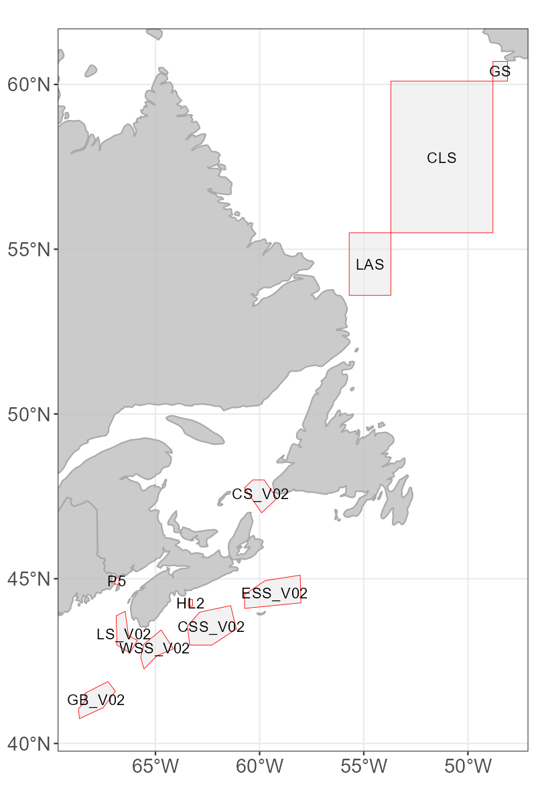
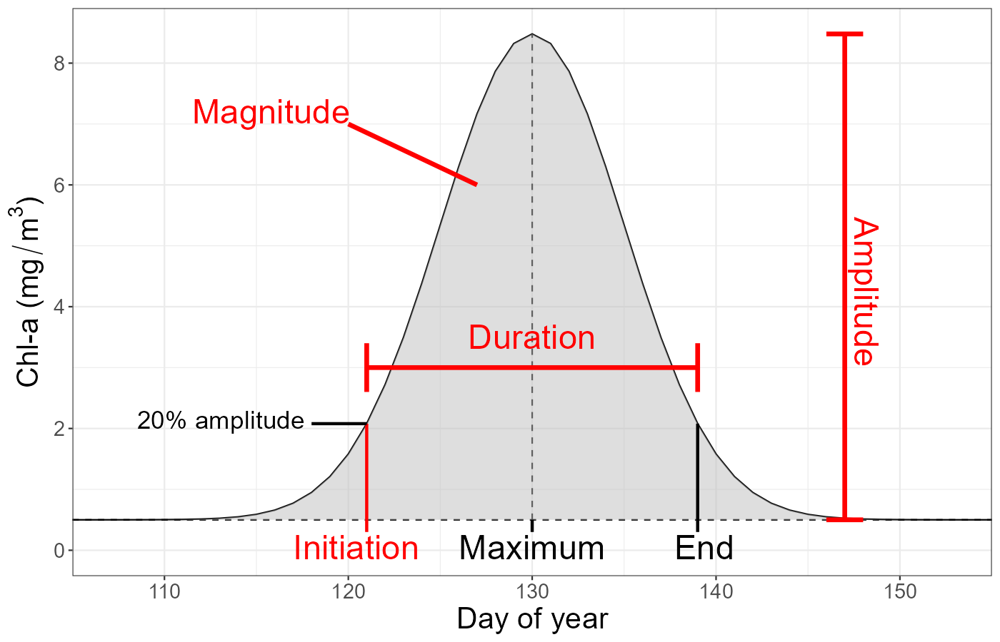
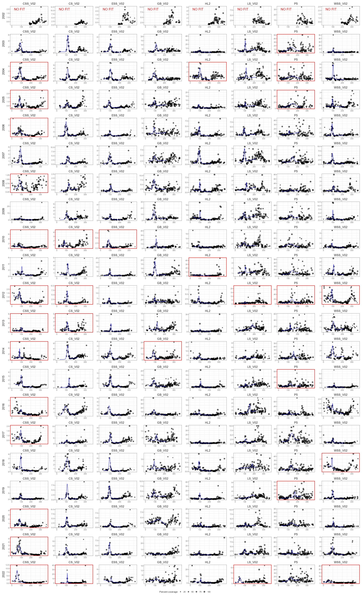
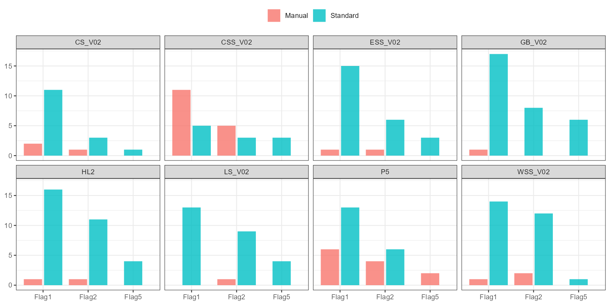
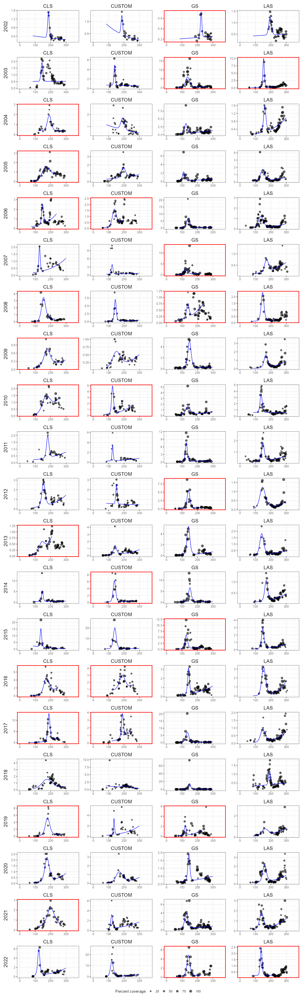
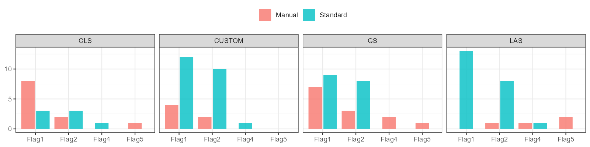

Verified bloom fits
================
2023-05-03

-   <a href="#background" id="toc-background">Background</a>
    -   <a href="#bloom-metrics" id="toc-bloom-metrics">Bloom metrics</a>
    -   <a href="#flags" id="toc-flags">Flags</a>
-   <a href="#gaussian-fits" id="toc-gaussian-fits">Gaussian fits</a>
    -   <a href="#azmp" id="toc-azmp">AZMP</a>
        -   <a href="#flags-1" id="toc-flags-1">Flags</a>
    -   <a href="#azomp" id="toc-azomp">AZOMP</a>
        -   <a href="#flags-2" id="toc-flags-2">Flags</a>

## Background

 

Time series of phytoplankton blooms, particularly in spring, often
follow an approximate Gaussian curve. The Northwest Atlantic (NWA) is
grouped into a series of polygons to investigate each region’s unique
interannual bloom dynamics. Several polygons of interest are plotted to
the right.

Daily mean chlorophyll-a (*chl-a*) is calculated within each polygon,
and a Gaussian is fitted to the data using the PhytoFit app. The
Gaussian parameters and other metrics are extracted from the fit and
compared to the metrics retrieved within the same polygon in other
years, in order to monitor changes in the timing and intensity of the
bloom. These parameters and metrics are stored for future use in our set
of “verified fits”.

For most fits, a standard group of PhytoFit input settings are used,
found in the settings file `phytofit_settings_AZMP_2021AZMPmeeting.txt`
(for AZMP polygons) or `phytofit_settings_AZOMP_2021AZMPmeeting.txt`
(for AZOMP polygons). However, each fit is inspected manually to judge
the “goodness” of fit, and if it can be improved the settings are
tweaked manually.

   

### Bloom metrics

The four main metrics monitored regularly are <b>initiation</b> (the
timing of the start of the bloom), <b>duration</b>, <b>amplitude</b>
(difference between the peak concentration and “background” *chl-a*),
and <b>magnitude</b> (area under the Gaussian curve between the start
and end of the bloom, or the total *chl-a* produced during the bloom
period). For the amplitude and magnitude calculations, we use the real
data points rather than the Gaussian curve - i.e. the maximum *chl-a*
concentration within the bloom period, and the area under the real data
points, linearly interpolating between days with missing data.

 

### Flags

Gaussian bloom fits are flagged if they meet any of the criteria below.
For amplitude and magnitude, “fit” refers to the metrics calculated
using the Gaussian curve, and “real” refers to metrics calculated using
the real data points. *Sigma* is a Gaussian curve parameter controlling
the width of the curve. *t* “sliders” are the controls used to restrict
the days used in the Gaussian fit.

| Flag  | Name                          | Description                                                                                                        |
|:------|:------------------------------|:-------------------------------------------------------------------------------------------------------------------|
| Flag1 | Amplitude ratio               | Flagged if (amplitudefit / amplitudereal) is outside the selected range (default 0.75-1.25). |
| Flag2 | Magnitude ratio               | Flagged if (magnitudefit / magnitudereal) is outside the selected range (default 0.85-1.15). |
| Flag3 | Small sigma                   | Flagged if sigma \<= time resolution (1 for daily data, 8 for weekly data).                                        |
| Flag4 | tstart on boundary | Flagged if the calculated tstart is on the boundary of the tstart slider.                    |
| Flag5 | tmax on boundary   | Flagged if the calculated tmax is on the boundary of the tmax slider.                        |
| Flag6 | tend on boundary   | Flagged if the calculated tend is on the boundary of the trange slider.                      |

 

## Gaussian fits

Below are the annual fits for each of the AZMP polygons (CSS, CS, ESS,
GB, HL2, LS, P5, and WSS) and AZOMP (CLS, GS, and LAS, as well as a
temporary “custom” box encompassing most of the Lab Sea). Panels
outlined in red were fit by manually changing the standard settings to
improve the fit. The “flags” barplots below each grid of Gaussians show
the number of times each polygon was marked by flags 1-6, separated by
whether the Gaussian was fit using the “standard” settings or if the
settings were tweaked manually.

### AZMP

Below are the verified fits for AZMP polygons. Bloom metrics and input
parameters from these fits can be downloaded
<a href="https://github.com/BIO-RSG/PhytoFit/tree/master/verified_fits/bloomfits_azmp">here</a>.

#### Flags

### AZOMP

Below are the verified fits for AZOMP polygons. Bloom metrics and input
parameters from these fits can be downloaded
<a href="https://github.com/BIO-RSG/PhytoFit/tree/master/verified_fits/bloomfits_azomp">here</a>.

#### Flags

 
