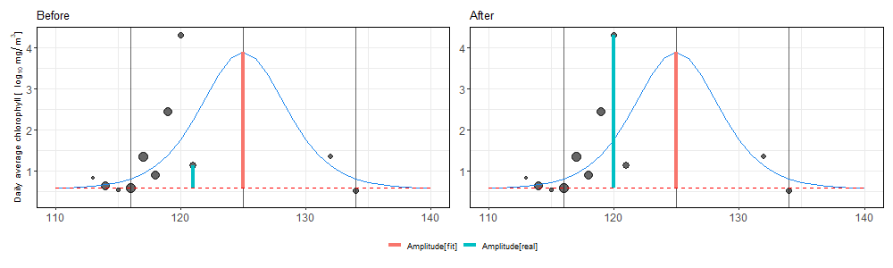
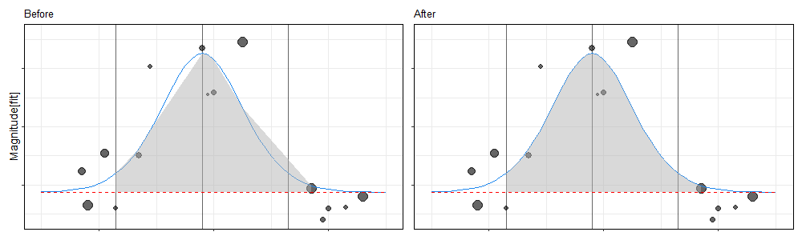
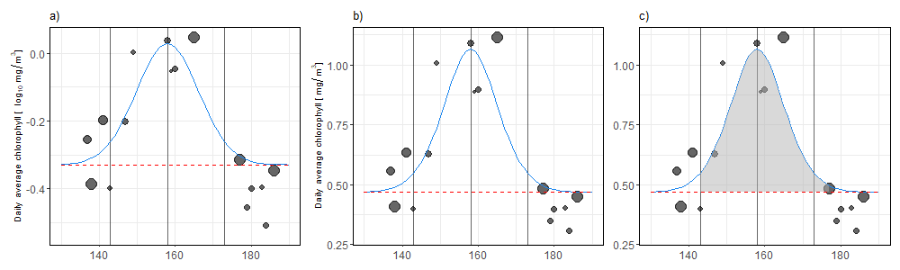
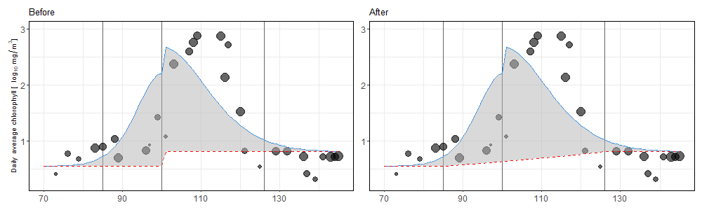
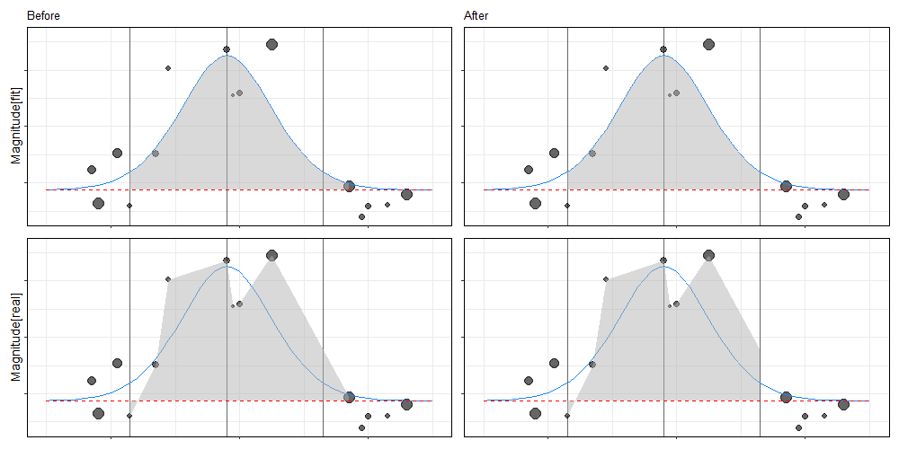
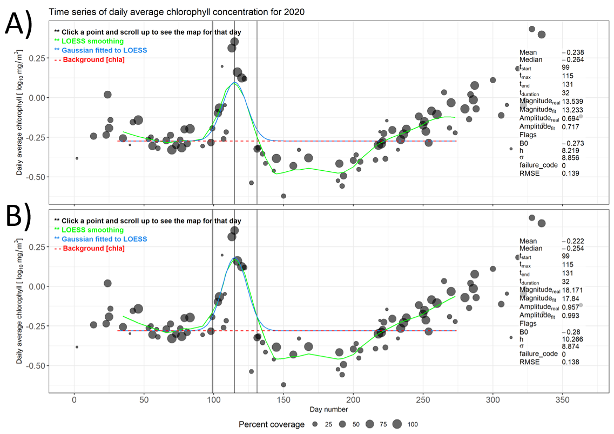

# Updates

This is a summary of updates to the algorithms (or updates to the code that affect the algorithms) since Feb 2021.  

*Note about variable names:*  

- ti = t[start]  
- tt = t[end]  

*Figures created using data and fits from the following:*  

- Fig.1: SAB 2020  
- Fig.2,3,5: LAS 2004  
- Fig.4: CS_V02 2020  
- Fig.6: AC 2020  

### Commit 1 - Feb 11, 2021

- Fixed range of days used in fit (endpoints were exclusive, now they are inclusive, consistent with ti_limits and tm_limits).  
  *Note: This can change the mean / median background chlorophyll-a, which in turn affects the height of the curve over the background chl-a, and therefore the calculated ti as well*  
- Fixed Gaussian so it returns no fit if calculated ti < 1 (previously it was ti < 0).  

***

### Commit 2 - Feb 28, 2021

- Merged Gaussian amplitude and magnitude into one value for asymmetric case (rather than left/right separate)  
- Fixed the way Gaussian amplitude is calculated (new method: amp_real = highest point between ti and tt, amp_fit = peak of curve, **see Fig.1**)  
- Fixed amplitude and magnitude calculations so they use a higher temporal resolution fitted curve, not just the fitted curve on days with valid data (which could be inaccurate if data is missing) (**see Fig.2**)  
- Adjusted code so if points are fitted in log space, then the real data, fitted curve, and background line would be transformed back to linear space before calculating amplitude and magnitude (**see Fig.3**). Before, the area between the background and the curve (or data points) was calculated while the values were still in log space.  

_**Fig.1**_: **Before (left):** Amplitude[real] was calculated using the real value closest to the peak of the curve, but this could result in an anomalous low value being selected, especially if there are large gaps in the data. **After (right):** The new method selects the largest value between ti and tt. Vertical lines mark ti, tmax, and tt.  

_**Fig.2**_: **Before (left)**: Magnitude[fit] is calculated using the fitted curve, but previously, any points on the curve that did not corresponding to days with valid data were not used in the calculation, resulting in gaps in the magnitude. **After (right)**: A temporary higher-resolution curve was created to calculate a more accurate area under the curve. Note that the start and end points were still set to the closest point with valid data. Vertical lines mark ti, tmax, and tt.  

_**Fig.3**_: **a)**: Points are fitted in log space. **b)**: Points, curve, and background line are converted back to linear space. **c)**: Magnitude is calculated (as well as amplitude). Vertical lines mark ti, tmax, and tt.  

***

### Commit 3 - Mar 2, 2021

- Changed asymmetric background chlorophyll-a calculation so it is a diagonal line between ti and tt (**see Fig.4**).  

_**Fig.4**_: **Before (left)**: The left and right background lines were divided at tmax. **After (right)**: Between ti and tt, a diagonal line was calculated. Vertical lines mark ti, tmax, and tt.  

***

### Commit 4 - Mar 8, 2021

- Fixed asymmetric amplitude_fit glitch where it chose highest point of one side or the other but not necessarily the highest overall.  
- Fixed magnitude calculations so if there is no valid data point at the calculated ti or tt of the Shifted Gaussian, it uses a linearly interpolated point (**see Fig.5**).  

_**Fig.5**_: **Before (left)**: If the calculated ti or tt did not have valid data on that day, the closest day with valid data was selected as the boundary for the magnitude calculation. **After (right)**: The calculated ti and tt are used to compute magnitude, inserting interpolated values if data is missing. Vertical lines mark ti, tmax, and tt.  

***

**CHANGES PULLED TO DMAPPS ON MAR 8, 2021**

***

  

### Commit 5 - Nov 11, 2021

- Fixed order of operations when LOESS smoothing and point-weighting are both selected (**see Fig.6**).  

{width=90%}  
_**Fig.6**_: **Before (A)**: When LOESS and weighting were both selected, the LOESS-smoothed points were fitted using the unweighted real data points, and then the Gaussian curve was fitted to the weighted LOESS values. **After (B)**: The LOESS-smoothed points are fitted using the weighted real data points, and then the Gaussian curve is fitted to the LOESS values.  

***

**CHANGES PULLED TO DMAPPS ON ????????????????????????????**

***

  

