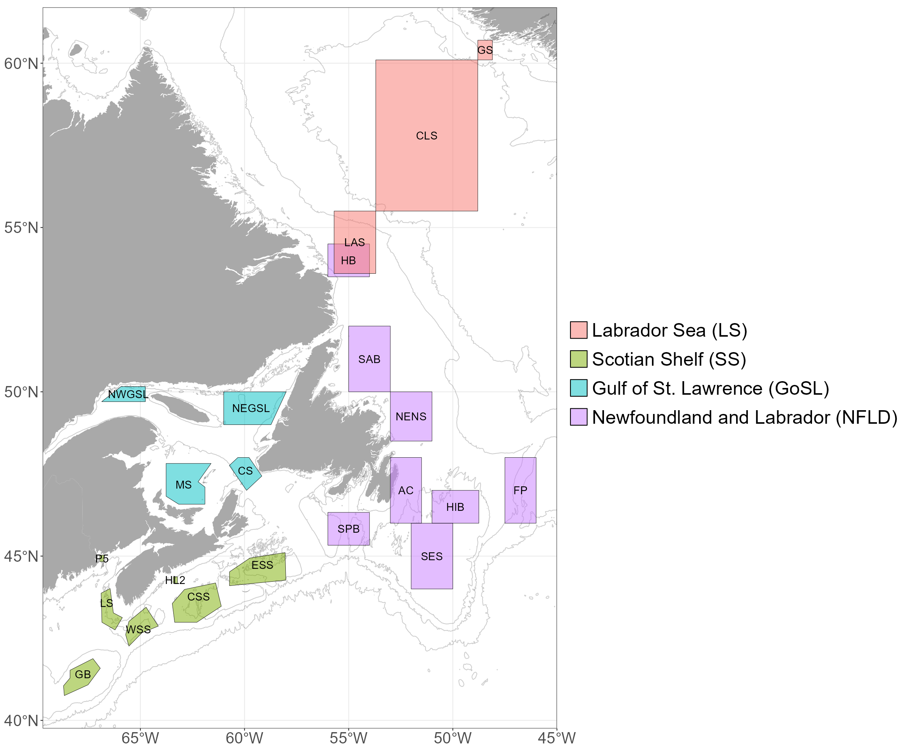

This folder contains parameters of the Gaussian curves fitted to polygons that are used in annual reporting (see map below), and the metrics derived from those curves (e.g. amplitude, magnitude) as well as basic annual statistics.

  

LS = Labrador Sea  
SS = Scotian Shelf  
GoSL = Gulf of Saint Lawrence  
NFLD = Newfoundland  

PhytoFit was used in combination with the standard settings (*phytofit_settings_AZMP_2021AZMPmeeting.txt* and *phytofit_settings_AZOMP_2021AZMPmeeting.txt*) for AZMP and AZOMP reporting in order to derive these fits for all years that have data available from the MODIS-Aqua satellite (2003-present). Fits were inspected manually and refit with slight adjustments to input parameters if necessary (e.g. moving t-sliders, switching tmax on/off, etc). Results were pulled into a single file (per main region and spring/fall) using the *tools_02_format_bloommetrics.R* script. A simple grid of Gaussian fits for each main region was generated using *tools_02c_gaussian_time series.R*.  
